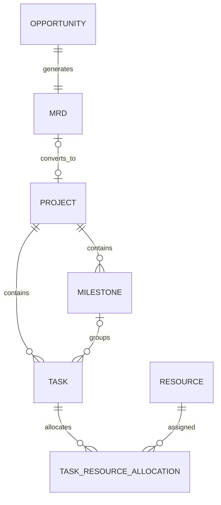
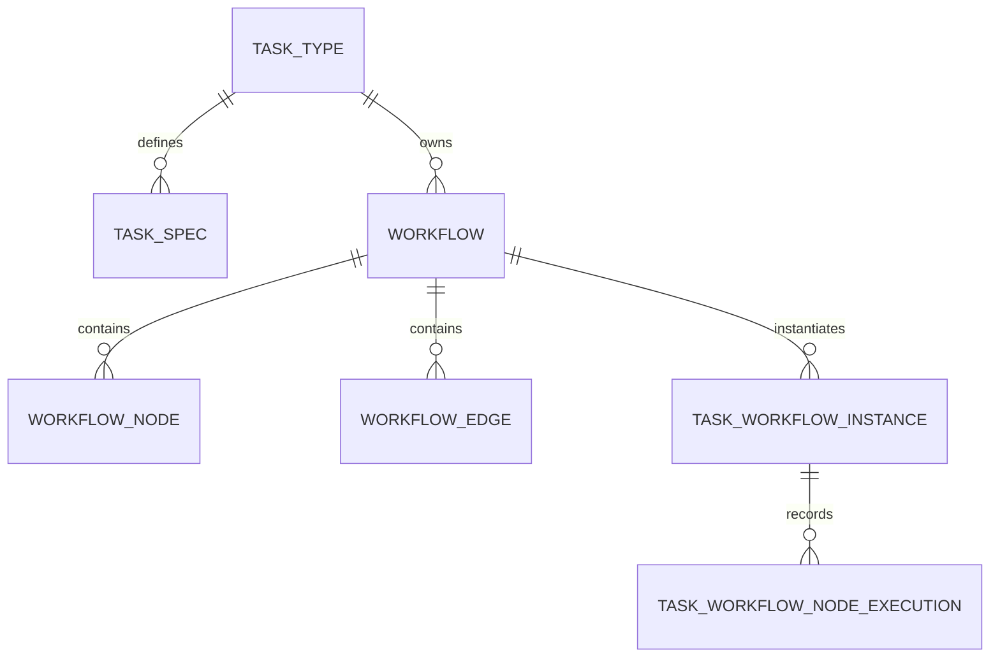
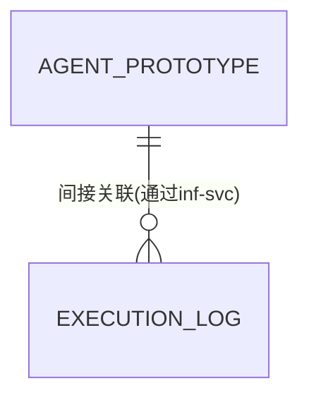
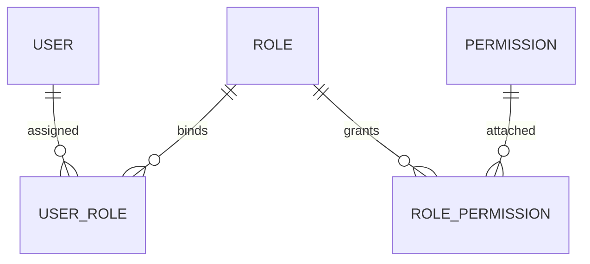
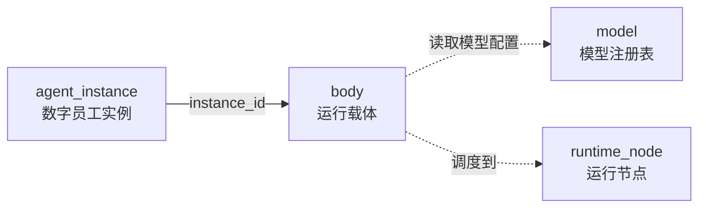

# 产研数字军团OS — 服务端架构设计

> **定位**：OS Server端从业务到部署的完整架构设计（占整体80%工作量）
> **读者**：服务端开发、Agent架构师
> **状态**：第1-4章已填充（含1.5网关设计），第5-9章待填充
> **关联文档**：01-架构全景与设计原则、01-业务架构设计

---

## 1. 系统架构

### 1.1 微服务拆分策略

基于DDD领域边界和AI Native特性，采用**渐进式拆分策略**：MVP阶段聚合高频联动域降低分布式复杂度，成长期按团队边界拆分，成熟期每个域独立服务。

#### 拆分原则
1. **领域边界优先**：每个微服务对应一个或多个domain，禁止跨域直接访问数据库
2. **数据独立性**：每个服务拥有自己的数据库，跨域查询通过API或事件溯源
3. **团队边界对齐**：成长期拆分按「2 Pizza Team」边界，避免过多跨服务协调
4. **AI特性隔离**：数字员工域（模型调用、Token消耗）独立部署，便于成本管控

#### MVP阶段（6个服务）—— 聚合以降低复杂度

| 服务名            | 包含域               | 拆分理由                                    | 数据库                                                            |
| -------------- | ----------------- | --------------------------------------- | -------------------------------------------------------------- |
| `pdm-svc`      | 经营决策域、项目管理域、项目实施域 | 三域高频联动（商机→项目→任务），本地事务保证一致性              | PostgreSQL（单库，JSONB存动态字段）                                      |
| `workflow-svc` | 产研流程域             | 任务规范定义相对稳定，被所有域引用，独立部署便于缓存优化            | PostgreSQL（单库，JSONB存流程定义）                                      |
| `agent-svc`    | 数字员工域             | 原型定义与任务分配逻辑，实例运行时由inf-svc管理             | PostgreSQL（JSONB存原型配置）+ Redis（任务调度缓存）                          |
| `iam-svc`      | 用户权限域             | 所有服务依赖认证授权，独立部署便于水平扩展                   | PostgreSQL（用户/角色/权限）                                           |
| `inf-svc`      | 基础设施域             | 实例生命周期管理+运行时+WebSocket通信+AI能力调用，需独立资源配额 | PostgreSQL（JSONB存节点状态/实例配置/Token记录）+ Redis（WebSocket会话/资源锁/配额） |
| `gateway-svc`  | 技术网关              | 统一入口：路由、JWT认证、限流、熔断、WebSocket升级         | Redis（限流计数、JWT黑名单）                                             |

**MVP聚合依据**：
- `pdm-svc`内3个域共享「项目执行」生命周期，跨域操作（如商机转项目、项目拆任务）需强一致性，单体服务避免Saga编排复杂度
- `workflow-svc`独立原因：产研流程域定义的是"如何工作"的规范，被所有核心域引用；独立部署便于缓存优化
- 其余服务均为「支撑型」或「异构存储」需求（AI日志、运行时状态），适合早期独立

#### 成长期（11个服务）—— 按团队边界拆分，引入BFF
**触发条件**：团队扩大至3个Feature Team；`pdm-svc`代码库冲突频繁；部署频率差异大（数字员工域每日部署，核心域每周部署）；前端页面增多需跨域聚合。

拆分动作：
1. **拆分`pdm-svc`为4个独立服务**：`decision-svc`（经营决策）、`project-svc`（项目管理）、`execution-svc`（项目实施）、`process-svc`（产研流程）
2. **`workflow-svc`同步调整**：`process-svc`即MVP的`workflow-svc`，成长期与其他服务对齐命名规范
3. **新增`asset-svc`**：技术资产域独立（需版本管理与复用推荐）
4. **新增`knowledge-svc`**：知识经验域独立（需向量数据库支持RAG）
5. **新增`portal-svc`**：BFF聚合层引入。服务数增多后前端跨域聚合需求显著，portal-svc 负责工作台、仪表盘等页面级数据组装与缓存

服务清单：

| 服务名             | 包含域   | 通信方式                            | 数据库                     |
| --------------- | ----- | ------------------------------- | ----------------------- |
| `decision-svc`  | 经营决策域 | 异步事件（RabbitMQ）                  | PostgreSQL              |
| `project-svc`   | 项目管理域 | 同步REST（OpenFeign）               | PostgreSQL              |
| `execution-svc` | 项目实施域 | 同步REST + 异步事件                   | PostgreSQL              |
| `process-svc`   | 产研流程域 | 异步事件（规范发布通知）                    | PostgreSQL              |
| `agent-svc`     | 数字员工域 | 同步REST（调用inf-svc管理实例/获取AI/通信能力） | PostgreSQL + Redis      |
| `asset-svc`     | 技术资产域 | 同步REST                          | PostgreSQL + 对象存储（资产文件） |
| `knowledge-svc` | 知识体系域 | 同步REST + 向量检索                   | PostgreSQL + 向量索引       |
| `iam-svc`       | 用户权限域 | 同步REST（所有服务调用）                  | PostgreSQL              |
| `inf-svc`       | 基础设施域 | 同步REST（agent-svc调用）             | PostgreSQL + Redis      |
| `portal-svc`    | 个人域   | 聚合API调用                         | Redis（缓存）               |

**成长期引入Saga模式**：跨服务长事务（如「项目创建→任务分解→资源分配」）使用事件编排式Saga，每个服务本地事务+补偿事务。

#### 成熟期（13个服务）—— 每个域独立部署
**触发条件**：团队规模>50人；需要灰度发布/AB测试；数据安全要求（如价值评估域需独立审计）。

新增服务：
1. **`value-svc`**：价值评估与兑现域独立（积分计算需独立安全域）
2. **`evolution-svc`**：自我进化域独立（改进需求跟踪需独立工作流）
3. **`portal-svc`拆分为多个BFF**：按前端边界对齐，如`project-portal`（项目管理前端）、`agent-portal`（数字员工前端），避免单体BFF成为瓶颈

最终服务拓扑（12个业务服务 + 3个基础设施服务）：

| 层级 | 服务名 | 职责 |
|------|--------|------|
| **核心业务层** | `decision-svc` | 商机管理、MRD审批 |
|  | `project-svc` | 项目全生命周期 |
|  | `execution-svc` | 任务分配、执行跟踪 |
|  | `process-svc` | 任务类型、工作流定义 |
| **能力支撑层** | `agent-svc` | 数字员工原型定义、任务分配调度 |
|  | `asset-svc` | 技术资产版本、复用推荐 |
|  | `knowledge-svc` | 知识体系、RAG检索 |
|  | `value-svc` | 价值项、价值规则、积分计算 |
|  | `evolution-svc` | 可改进项、优化闭环 |
| **基础设施层** | `iam-svc` | 用户、角色、权限（所有服务依赖） |
|  | `inf-svc` | Body运行时、WebSocket/ACP通信、模型管理、AI能力调用 |
|  | `portal-svc` | BFF聚合层（前端调用入口） |
|  | `gateway-svc` | 技术网关（路由、JWT认证、限流、熔断、WebSocket升级） |
| **数据基础设施** | RabbitMQ | 异步事件总线 |
|  | Redis Cluster | 缓存、会话、分布式锁 |
|  | PostgreSQL Cluster | 业务数据（分库分表，JSONB存半结构化数据） |
|  | （已统一到PostgreSQL） | 文档数据统一用PostgreSQL+JSONB |
|  | 向量数据库 | 知识嵌入、相似度检索 |

#### 拆分决策树
```
是否多个域高频联动且需强一致性？
├─ 是 → 暂聚合在单体服务（MVP阶段）
├─ 否 → 是否团队边界清晰可独立部署？
│   ├─ 是 → 拆分为独立服务（成长期）
│   └─ 否 → 继续聚合
└─ 是否需独立数据安全/合规管控？
    ├─ 是 → 强制独立（如value-svc）
    └─ 否 → 按团队带宽决定
```

> **设计决策**：MVP阶段接受「逻辑拆分、物理聚合」的折中，优先保证交付速度；成长期通过事件溯源+ Saga解决分布式事务；成熟期每个域独立数据库+服务。

---

### 1.2 服务清单与职责

基于MVP阶段（6个服务）详细定义每个服务的职责边界、API契约、数据存储。
#### 1.2.1 pdm-svc（核心业务服务）

**职责边界**：
- 经营决策域：商机创建/评估/转化、MRD生成与审批
- 项目管理域：项目CRUD、里程碑管理、资源协调
- 项目实施域：任务分配/执行/验收、资源可用时间管理

**对外API概要**（RESTful）：

| 接口路径                                  | 方法   | 职责            | 权限要求    |
| ------------------------------------- | ---- | ------------- | ------- |
| `/api/v1/opportunities`               | POST | 创建商机          | 经营管理者   |
| `/api/v1/opportunities/{id}/evaluate` | POST | 商机评估          | 经营管理者   |
| `/api/v1/opportunities/{id}/convert`  | POST | 商机转化（创建项目）    | 经营管理者   |
| `/api/v1/projects`                    | POST | 直接创建项目（OS外来源） | 复合型研发经理 |
| `/api/v1/projects/{id}/milestones`    | GET  | 查询项目里程碑       | 项目成员    |
| `/api/v1/tasks`                       | POST | 创建任务          | 复合型研发经理 |
| `/api/v1/tasks/{id}/assign`           | POST | 分配任务给执行者      | 复合型研发经理 |
| `/api/v1/tasks/{id}/complete`         | POST | 标记任务完成        | 任务执行者   |

**发布事件**（RabbitMQ）：

| 事件名 | 触发场景 | 消费方 | 投递保证 |
|--------|---------|--------|---------|
| `Opportunity.Converted` | 商机转化成功，内部创建项目 | 本服务内（本地事务，跨域联动） | 本地事务 |
| `Project.Created` | 项目创建成功 | 前端（SSE推送刷新） | at-least-once |
| `Task.Assigned` | 任务分配给执行者 | 数字员工域（`agent-svc`） | at-least-once |
| `Task.Completed` | 任务标记完成 | 本服务内（更新项目进度） | at-least-once |
| `Task.Blocked` | 任务遇到阻塞 | 本服务内 + 经理通知 | at-least-once |
| `Resource.AvailabilityChanged` | 资源可用时间变更 | 本服务内（更新资源协调） | at-least-once |

**消费事件**（RabbitMQ）：

| 事件名 | 来源 | 处理逻辑 |
|--------|------|---------|
| `Agent.TaskCompleted` | 数字员工域（`agent-svc`） | 更新任务状态、记录交付物与证据 |
| `TaskSpec.Published` | 产研流程域（`workflow-svc`） | 刷新本地任务规范缓存 |
| `TaskSpec.Updated` | 产研流程域（`workflow-svc`） | 刷新本地任务规范缓存 |

**端口**：8080（HTTP）、9090（Actuator健康检查）

**数据存储**：PostgreSQL 16+（单库，JSONB存动态字段）
- `opportunity`（商机表）
- `mrd`（市场需求文档表）
- `project`（项目表）
- `task`（任务表）
- `resource`（资源表）

**关键设计**：
- 使用`@Transactional`保证跨域操作原子性（如商机转化→创建项目→初始化任务）
- 领域事件通过`DomainEventPublisher`发布到RabbitMQ，异步通知其他服务

![[f55fce03-ac45-42a4-92cf-c73ac82f5a07.png]]

---

#### 1.2.2 workflow-svc（产研流程服务）
**职责边界**：
- 任务类型定义（TaskType）：任务分类与特征定义，决定适用场景
- 任务规范（TaskSpec）：定义任务执行的技能要求、工具列表、判定规则
- 工作流配置（Workflow）：任务执行流程定义，节点与判定规则
- 规范发布与版本管理：任务规范的版本控制与灰度发布
- 流程实例管理：任务执行流程的实例化与状态跟踪

**对外API概要**（RESTful）：

| 接口路径 | 方法 | 职责 | 权限要求 |
|----------|------|------|----------|
| `/api/v1/task-types` | GET | 查询任务类型列表 | 所有用户 |
| `/api/v1/task-types` | POST | 创建任务类型 | 产研流程管理员 |
| `/api/v1/task-specs` | GET | 查询任务规范 | 所有用户 |
| `/api/v1/task-specs` | POST | 创建/更新任务规范 | 产研流程管理员 |
| `/api/v1/task-specs/{id}/publish` | POST | 发布任务规范新版本 | 产研流程管理员 |
| `/api/v1/workflows` | GET | 查询工作流列表 | 所有用户 |
| `/api/v1/workflows` | POST | 创建/更新工作流 | 产研流程管理员 |
| `/api/v1/workflow-instances` | POST | 创建流程实例（任务执行） | 复合型研发经理 |
| `/api/v1/workflow-instances/{id}` | GET | 查询流程实例状态 | 项目成员 |

**发布事件**（RabbitMQ）：

| 事件名 | 触发场景 | 消费方 | 投递保证 |
|--------|---------|--------|---------|
| `TaskSpec.Published` | 任务规范发布新版本 | `pdm-svc`（刷新缓存） | at-least-once |
| `TaskSpec.Updated` | 任务规范内容更新 | 所有订阅域（刷新缓存） | at-least-once |

**端口**：8084（HTTP）、9095（Actuator）

**数据存储**：PostgreSQL 16+（单库，JSONB存动态字段）
- `task_type`（任务类型表）
- `task_spec`（任务规范表）
- `workflow`（工作流定义表）
- `workflow_instance`（流程实例表）
- `workflow_node`（流程节点表）

**缓存策略**：
- 任务规范缓存：Redis（TTL=5分钟），降低跨服务调用延迟
- 规范变更事件：`TaskSpec.Updated`事件通知订阅方刷新缓存

**关键设计**：
- 任务规范版本管理：支持灰度发布，逐步推送到所有执行者
- 工作流引擎：基于状态机实现节点流转，支持人工审核节点
- 规范引用统计：跟踪任务规范被多少项目/任务使用，指导优化

![[a6933d2b-94d6-40b0-9619-9c928d50e5d6.png]]

---

#### 1.2.3 agent-svc（数字员工服务）
**职责边界**：
- 数字员工原型管理（创建/更新/版本控制）
- 数字员工实例生命周期（创建/启动/暂停/销毁）
- 运行环境配置管理（模型选择、工具权限、上下文窗口）
- 任务分配逻辑（技能匹配、负载均衡、实例调度）

> **注意**：Server-ACP通信（WebSocket长连接管理、任务推送、结果接收）和 AI能力调用（LLM路由、Token计量、成本追踪）已移至 `inf-svc`。agent-svc 不直接管理连接和模型调用，通过 inf-svc 间接使用这些能力。

**对外API概要**：

| 接口路径 | 方法 | 职责 | 权限要求 |
|----------|------|------|----------|
| `/api/v1/agent-prototypes` | POST | 创建数字员工原型 | AI Agent架构师 |
| `/api/v1/agent-instances` | POST | 实例化数字员工 | 复合型研发经理 |
| `/api/v1/agent-instances/{id}/start` | POST | 启动数字员工 | 复合型研发经理 |
| `/api/v1/agent-instances/{id}/stop` | POST | 停止数字员工 | 复合型研发经理 |
| `/api/v1/agent-instances/{id}/assign-task` | POST | 分配任务给数字员工 | 复合型研发经理 |

**发布事件**（RabbitMQ）：

| 事件名 | 触发场景 | 消费方 | 投递保证 |
|--------|---------|--------|---------|
| `Agent.TaskAssigned` | 任务分配给数字员工 | inf-svc → WebSocket转发至实例 | WebSocket推送 |
| `Agent.TaskCompleted` | 数字员工完成任务上报 | 项目实施域（`pdm-svc`） | at-least-once |

**消费事件**（RabbitMQ）：

| 事件名 | 来源 | 处理逻辑 |
|--------|------|---------|
| `Task.Assigned` | 项目实施域（`pdm-svc`） | 技能匹配、选择实例、调用inf-svc推送任务 |
| `Agent.InstanceCreated` | 基础设施域（`inf-svc`） | 更新实例状态，关联原型信息 |

**端口**：8081（HTTP）、9091（Actuator）

**数据存储**：
- PostgreSQL 16+（JSONB存任务日志、对话历史、执行结果、Agent配置）
- Redis（任务队列、实例调度缓存）

**关键设计**：
- agent-svc 通过 OpenFeign 调用 inf-svc 的 WebSocket 推送接口向数字员工实例下发任务
- agent-svc 通过 OpenFeign 调用 inf-svc 的 LLM 生成接口获取 AI 能力
- Token 配额由 inf-svc 管理，agent-svc 只读取配额状态做调度决策

![[b36854e2-cdad-4c4f-849d-f11b1c9fbb3a.png]]

---

#### 1.2.4 iam-svc（身份权限服务）
**职责边界**：
- 用户生命周期管理（人/数字员工都是用户）
- 角色定义与权限分配
- 认证链路（JWT签发与验证）
- 功能权限校验（所有服务调用`iam-svc`验证权限）

**对外API概要**：

| 接口路径 | 方法 | 职责 | 权限要求 |
|----------|------|------|----------|
| `/api/v1/users` | POST | 创建用户（人/数字员工） | 系统管理员 |
| `/api/v1/users/{id}/roles` | POST | 分配角色给用户 | 系统管理员 |
| `/api/v1/roles` | POST | 创建角色 | 系统管理员 |
| `/api/v1/permissions` | POST | 创建权限 | 系统管理员 |
| `/api/v1/auth/login` | POST | 用户登录（获取JWT） | 公开 |
| `/api/v1/auth/verify` | POST | 验证JWT有效性 | 所有服务 |
| `/api/v1/auth/check-permission` | POST | 校验用户是否有某功能权限 | 所有服务 |

**端口**：8082（HTTP）、9093（Actuator）

**数据存储**：PostgreSQL 16+（单库）
- `user`（用户表）
- `role`（角色表）
- `permission`（权限表）
- `user_role`（用户角色关联表）
- `role_permission`（角色权限关联表）

**关键设计**：
- 所有服务通过`@FeignClient("iam-svc")`调用权限校验接口
- JWT包含`user_id`、`roles`、`permissions`字段，减少`iam-svc`调用频率
- 数字员工的功能权限由`iam-svc`管理，业务能力由`agent-svc`配置

![[3bdb5ac1-916c-4e6b-9cfd-ba6e5ca01faf.png]]

---

#### 1.2.5 inf-svc（基础设施服务）
**职责边界**：
- 数字员工Body运行时管理（启动/停止/监控）
- Server-ACP通信（WebSocket长连接管理、任务推送、结果接收、心跳保活）
- AI能力调用（LLM路由、Token计量、成本追踪、配额管理）
- 模型管理（版本、配置、下载）
- 项目上下文管理（代码仓库、文档、环境配置）
- 运行节点管理（资源配额、隔离策略）
- 外部系统适配（GitLab/Jira/企业微信）

**对外API概要**：

| 接口路径 | 方法 | 职责 | 权限要求 |
|----------|------|------|----------|
| `/api/v1/bodies` | POST | 创建数字员工Body实例 | agent-svc |
| `/api/v1/bodies/{id}/start` | POST | 启动Body | agent-svc |
| `/api/v1/bodies/{id}/stop` | POST | 停止Body | agent-svc |
| `/ws/v1/agent/{instanceId}` | WebSocket | Server-ACP通信 | 数字员工实例（JWT认证） |
| `/api/v1/llm/generate` | POST | AI生成接口（LLM路由+Token计量） | agent-svc |
| `/api/v1/llm/quota/{instanceId}` | GET | 查询Token配额状态 | agent-svc |
| `/api/v1/models` | GET | 查询可用模型列表 | agent-svc |
| `/api/v1/contexts` | POST | 创建项目上下文 | 复合型研发经理 |
| `/api/v1/nodes` | GET | 查询运行节点状态 | 系统管理员 |
| `/api/v1/adapters/gitlab/*` | ALL | GitLab适配器代理 | agent-svc |

**发布事件**（RabbitMQ）：

| 事件名 | 触发场景 | 消费方 | 投递保证 |
|--------|---------|--------|---------|
| `Agent.InstanceCreated` | 数字员工实例创建成功 | 数字员工域（`agent-svc`） | at-least-once |
| `Agent.InstanceStopped` | 实例停止（手动/配额耗尽/异常） | 数字员工域（`agent-svc`） | at-least-once |
| `Token.QuotaExceeded` | Token配额耗尽 | 数字员工域（`agent-svc`） | at-least-once |

**消费事件**（RabbitMQ）：

| 事件名 | 来源 | 处理逻辑 |
|--------|------|---------|
| `Agent.TaskAssigned` | 数字员工域（`agent-svc`） | 通过WebSocket推送给对应数字员工实例 |

**端口**：8083（HTTP）、9092（WebSocket）、9094（Actuator）

**数据存储**：
- PostgreSQL 16+（JSONB存节点状态、Body配置、Token消耗记录、成本快照）
- Redis（WebSocket会话状态、资源锁、Token配额、节点健康状态缓存）

**关键设计**：
- WebSocket连接使用JWT认证，每个实例独占一个连接
- LLM调用通过`LLMRouter`组件隔离外部API差异（OpenAI/Claude/通义千问）
- Token消耗实时计量，超过配额自动暂停实例并通知 agent-svc
- 外部系统适配通过`ExternalAdapter`组件实现ACL（防腐层）
- Body运行时使用Docker容器隔离，每个实例独立资源配额
- 项目上下文存储在对象存储（MinIO），通过`context_id`关联

![[6b260d74-39e9-4289-b81e-1eb18f6fec2d.png]]

---

#### 1.2.6 portal-svc（聚合服务/BFF）— 成长期引入

> **MVP 阶段不引入 portal-svc**。MVP 服务数少（6个），前端页面有限，直接通过 gateway-svc 调业务服务即可。以下设计为成长期参考。

**存在意义**：
- `portal-svc` 是面向前端页面和用户场景的聚合层，它的目标不是承载核心业务规则，而是把多个后端服务的数据组织成前端容易消费的结果。
- 对前端来说，它提供的是“个人工作台”“项目仪表盘”“通知中心”这类页面级接口，而不是暴露内部微服务的原始边界。
- 对后端来说，它把前端与内部服务拓扑解耦，即使后续服务拆分、接口调整或数据模型演进，前端也不需要跟着频繁改动。
- 它还能统一承担页面级缓存、聚合查询和读模型组织，减少前端多次请求和跨服务拼装的复杂度。

**引入触发条件**：服务拆到 10+ 个，前端单页面需聚合 3+ 个服务的数据，并行请求延迟不可接受。

**职责边界**：
- 业务数据聚合（个人工作台、项目仪表盘、价值积分展示）
- 缓存管理（Redis缓存聚合结果，减少跨服务调用）
- SSE 实时推送（任务进度、数字员工状态变更）

> **注意**：`portal-svc` 不负责路由、认证、限流等技术切面，这些由 `gateway-svc` 处理。前端请求先经过 `gateway-svc`，再到达 `portal-svc` 或直接到达业务服务。

**对外API概要**：

| 接口路径 | 方法 | 职责 | 权限要求 |
|----------|------|------|----------|
| `/api/v1/portal/workbench/{userId}` | GET | 获取个人工作台数据 | 本人或管理者 |
| `/api/v1/portal/project-dashboard/{projectId}` | GET | 获取项目仪表盘 | 项目成员 |
| `/api/v1/portal/value-points/{userId}` | GET | 查询用户价值积分 | 本人或管理者 |
| `/api/v1/portal/notifications` | GET | 获取用户通知列表 | 已登录用户 |

**端口**：8085（HTTP）

**数据存储**：Redis（缓存聚合结果，TTL 5分钟）

**关键设计**：
- 使用`@Cacheable`注解缓存跨服务聚合结果
- 通过RabbitMQ事件总线监听数据变更事件，主动失效缓存

---

#### 服务依赖关系总览（MVP）
```
gateway-svc (统一入口)
    │
    ├── iam-svc (认证授权，所有服务依赖)
    ├── pdm-svc (经营决策 + 项目管理 + 项目实施)
    ├── workflow-svc (产研流程)
    ├── agent-svc (数字员工)
    │       │
    │       └── inf-svc (运行时支持)
    │
    └── (未来扩展) asset-svc, knowledge-svc, value-svc...
```

> **设计决策**：MVP阶段前端通过gateway-svc直接调业务服务，成长期引入`portal-svc`作为BFF层聚合数据，成熟期可拆分为多个BFF（如`project-portal`、`agent-portal`）按前端边界对齐。

---

### 1.3 服务拓扑图

以下是产研数字军团OS在MVP阶段的服务拓扑图，展示服务间依赖、通信方式与调用关系。

```
┌──────────────────────────────────────────────────────────────────────────────┐
│                          产研数字军团OS — 服务拓扑图（MVP）                   │
├──────────────────────────────────────────────────────────────────────────────┤
│                                                                              │
│                              ┌──────────────┐                               │
│                              │   前端应用    │                               │
│                              │   (Web/iOS) │                               │
│                              └──────┬───────┘                               │
│                                     │ HTTPS                                 │
│                                     ▼                                       │
│                              ┌──────────────┐                               │
│                              │ gateway-svc  │◄─────── 统一入口              │
│                              │  (JWT/路由/限流)│                               │
│                              └──────┬───────┘                               │
│                                     │ 内网HTTP (端口8080-8084)              │
│                                     │                                       │
│         ┌───────────────────────────┼───────────────────────────┐           │
│         │                           │                           │           │
│         ▼                           ▼                           ▼           │
│  ┌──────────────┐         ┌──────────────┐         ┌──────────────┐     │
│  │  pdm-svc    │◄────────│  workflow-svc│         │  iam-svc    │     │
│  │  (端口8080)  │  OpenFeign          │  (端口8084)  │         │  (端口8082)  │     │
│  │              │  (同步调用)          │              │         │              │     │
│  │ 经营决策域    │                     │ 产研流程域    │         │ 用户/角色    │     │
│  │ 项目管理域    │────────────────────▶│              │         │ 权限         │     │
│  │ 项目实施域    │  OpenFeign          │ 任务类型     │         │              │     │
│  │              │  (获取任务规范)      │ 任务规范     │         │              │     │
│  └──────┬───────┘                     │ 工作流定义   │         └──────────────┘     │
│         │                               └──────────────┘                           │
│         │                                                                     │
│         └──── 所有服务通过OpenFeign调用 iam-svc 验证权限 ─────────────┘   │
│                                                                              │
│  【通信方式图例】                                                              │
│  ─────→  : 同步HTTP调用（OpenFeign）                                       │
│  ⇢⇢⇢⇢⇢⇢  : 异步事件（RabbitMQ）                                         │
│  ⟿⟿⟿⟿⟿⟿  : WebSocket长连接（Server-ACP）                                  │
│  ═════→  : 前端HTTPS调用（JWT认证）                                        │
│                                                                              │
└──────────────────────────────────────────────────────────────────────────────┘
```

**拓扑关系解读**：

**1. 前端 → gateway-svc（HTTPS）**
- 所有外部请求统一通过 `gateway-svc`（技术网关）入口
- `gateway-svc` 验证 JWT 签名和过期时间，将用户信息注入请求头
- 根据路径前缀路由到对应业务服务

**2. gateway-svc → 业务服务（HTTP）**
- MVP阶段前端通过gateway-svc直接调业务服务，无需BFF层
- 成长期引入portal-svc后，跨域聚合请求（如个人工作台需同时查询 `pdm-svc`、`agent-svc`、`value-svc`）由portal-svc统一组装

**3. pdm-svc → workflow-svc（OpenFeign）**
- 任务分配时，`pdm-svc`的`TaskService`调用`workflow-svc`获取任务规范
- 同步调用保证任务分配实时性，失败则抛出异常触发事务回滚
- `workflow-svc`的结果会被`pdm-svc`缓存（Redis，TTL=5分钟）

**4. pdm-svc → RabbitMQ → agent-svc（异步事件）**
- `pdm-svc`发布`Task.Assigned`事件到RabbitMQ
- `agent-svc`监听队列，通过`inf-svc`的WebSocket推送接口转发任务给数字员工实例
- 保障至少一次投递（at-least-once），消费者需实现幂等性

**5. agent-svc → inf-svc（OpenFeign）**
- 数字员工实例启动时，`agent-svc`调用`inf-svc`的`/api/v1/bodies`创建Body运行时
- 任务分发时，`agent-svc`调用`inf-svc`的WebSocket推送接口下发任务
- AI能力调用时，`agent-svc`调用`inf-svc`的`/api/v1/llm/generate`接口
- 调用链：`agent-svc` → `inf-svc` → Docker API（启动容器）/ WebSocket（推送任务）/ LLM API（生成内容）

**6. 所有服务 → iam-svc（OpenFeign）**
- 每个服务的`@PreAuthorize`注解触发权限校验
- `iam-svc`提供`/api/v1/auth/check-permission`接口，验证用户是否有某功能权限
- JWT包含`permissions`字段，减少`iam-svc`调用频率（本地校验）

**7. inf-svc ↔ 数字员工实例（WebSocket）**
- 数字员工实例启动后，通过`inf-svc`的`/ws/v1/agent/{instanceId}`建立WebSocket连接
- `inf-svc`推送任务（`Agent.TaskAssigned`消息），实例上报结果（`Agent.TaskCompleted`消息）
- `inf-svc`接收结果后，通过事件或回调通知`agent-svc`
- 心跳机制：每30秒发送Ping帧，超时60秒无响应则标记实例离线

---

#### 成长期服务拓扑变化（11个服务）
```
前端应用
    │
    ▼
gateway-svc → portal-svc (BFF聚合层，新增)
    │
    ├── iam-svc (认证授权)
    ├── decision-svc (经营决策) ──▶ project-svc (项目管理)
    ├── project-svc ──▶ execution-svc (项目实施)
    ├── process-svc (产研流程) ──▶ execution-svc
    ├── agent-svc (数字员工)
    ├── asset-svc (技术资产)
    ├── knowledge-svc (知识经验)
    └── inf-svc (基础设施)
```

**关键变化**：
- `pdm-svc`拆分为4个独立服务（`decision-svc`, `project-svc`, `execution-svc`, `process-svc`）
- `workflow-svc`重命名为`process-svc`，与其他服务命名对齐
- 跨服务调用通过**Saga编排**保证最终一致性（如项目创建→任务分解→资源分配）
- 新增`asset-svc`和`knowledge-svc`，为技术资产和知识经验提供独立API
- **新增`portal-svc`**：服务数增多，引入BFF聚合层处理跨域数据组装

---

#### 成熟期服务拓扑变化（13个服务）
```
前端应用
    │
    ▼
gateway-svc → project-portal / agent-portal (多BFF，由portal-svc拆分)
    │
    ├── iam-svc (认证授权)
    ├── decision-svc (经营决策)
    ├── project-svc (项目管理)
    ├── execution-svc (项目实施)
    ├── process-svc (产研流程)
    ├── agent-svc (数字员工)
    ├── asset-svc (技术资产)
    ├── knowledge-svc (知识经验)
    ├── value-svc (价值评估)  ← 新增，独立安全域
    ├── evolution-svc (自我进化) ← 新增，改进需求跟踪
    └── inf-svc (基础设施)
```

**关键变化**：
- 所有域独立部署，每个服务拥有自己的数据库
- `value-svc`和`evolution-svc`独立，需通过`iam-svc`进行细粒度权限控制
- 服务间通信全面异步化（事件驱动架构），同步调用仅用于实时性要求高的场景

> **设计决策**：MVP阶段同步调用为主、异步事件为辅；成长期引入Saga模式；成熟期全面异步化+事件溯源。

---

### 1.4 演进路线图

基于业务增长、团队规模和技术复杂度，制定从MVP到成熟期的服务演进路线图。

#### 阶段一：MVP（最小可行产品）—— 快速验证
**目标**：验证AI Native项目管理的核心价值，支持5人团队管理10个并行项目。

**服务规模**：7个服务（5个业务服务 + 1个BFF + 1个网关）

**技术选型**：
- **部署**：Docker Compose（单机部署，快速迭代）
- **数据库**：PostgreSQL 16+（单库，JSONB统一存储结构化+半结构化数据）、Redis（缓存/会话/限流）
- **事件总线**：RabbitMQ（异步事件）
- **认证**：JWT（无状态认证，网关层验签）
- **网关**：Spring Cloud Gateway（路由、限流、熔断、WebSocket升级）

**团队配置**：
- 2个Feature Team（每个团队2-3人）
- Team A：`pdm-svc` + `gateway-svc`
- Team B：`agent-svc` + `inf-svc` + `iam-svc` + `workflow-svc`

**关键里程碑**：
1. **第1个月**：完成`pdm-svc`（商机→项目→任务）核心流程 + `gateway-svc`（基础路由 + JWT认证）
2. **第2个月**：完成`workflow-svc`（任务类型、工作流定义）+ `agent-svc`（原型定义、任务分配）+ `inf-svc`（实例生命周期管理）
3. **第3个月**：完成`iam-svc` + `inf-svc`（认证 + 运行时管理 + WebSocket/ACP通信）
4. **第4个月**：完成`iam-svc`认证完善 + 网关限流/熔断 + 端到端测试

**退出条件（进入成长期）**：
- 支持50个并行项目、100个数字员工实例
- 团队扩大至3个Feature Team（>8人）
- `pdm-svc`代码库冲突频繁（每周>3次合并冲突）
- 需要独立部署频率（数字员工域每日部署，核心域每周部署）

---

#### 阶段二：成长期（业务增长）—— 按领域拆分
**目标**：支持50人团队管理100个并行项目，支持灰度发布和AB测试。

**服务规模**：11个服务（9个业务服务 + 1个BFF + 1个网关）

**技术升级**：
- **部署**：Kubernetes（集群编排，支持自动扩缩容）
- **数据库**：PostgreSQL Cluster（分库分表，JSONB支持半结构化数据）
- **服务通信**：OpenFeign（同步） + RabbitMQ（异步） + Saga模式（分布式事务）
- **监控**：Prometheus + Grafana（指标监控）、Jaeger（链路追踪）

**团队配置**：
- 3个Feature Team（每个团队4-5人）
- Team A：`decision-svc` + `project-svc`（经营决策 + 项目管理）
- Team B：`execution-svc` + `process-svc`（项目实施 + 产研流程）
- Team C：`agent-svc` + `asset-svc` + `knowledge-svc`（数字员工 + 技术资产 + 知识经验）
- 共享服务：`iam-svc`、`inf-svc`、`portal-svc`（基础设施团队维护，portal-svc 为成长期引入）

**关键里程碑**：
1. **第1个月**：拆分`pdm-svc`为4个独立服务（`decision-svc`、`project-svc`、`execution-svc`、`process-svc`）
2. **第2个月**：引入Saga模式，实现「项目创建→任务分解→资源分配」分布式事务
3. **第3个月**：新增`asset-svc`（技术资产域）和`knowledge-svc`（知识经验域）
4. **第4-6个月**：完善监控体系（指标、链路、日志），支持灰度发布

**退出条件（进入成熟期）**：
- 支持200个并行项目、500个数字员工实例
- 团队规模>50人，需要更细粒度的服务隔离
- 数据安全要求（`value-svc`需独立审计）
- 需要独立成本核算（每个服务的Token消耗、基础设施成本）

---

#### 阶段三：成熟期（规模化）—— 每个域独立部署
**目标**：支持200+人团队管理500+个并行项目，支持多租户和独立安全域。

**服务规模**：12个服务（12个业务服务 + 3个基础设施服务）

**技术升级**：
- **部署**：Kubernetes多集群（跨AZ高可用）、Istio（服务网格）
- **数据库**：每个服务独立PostgreSQL数据库（分库分表，JSONB支持半结构化数据），读写分离
- **服务通信**：全面异步化（事件驱动架构）、事件溯源（Event Sourcing）
- **安全**：Vault（密钥管理）、OPA（策略即代码）、审计日志（合规要求）

**团队配置**：
- 6个Feature Team（每个团队6-8人）+ 1个平台团队
- Team A：`decision-svc` + `project-svc`
- Team B：`execution-svc` + `process-svc`
- Team C：`agent-svc` + `inf-svc`
- Team D：`asset-svc` + `knowledge-svc`
- Team E：`value-svc` + `evolution-svc`
- Team F：`portal-svc`（成长期引入）+ 前端应用
- 平台团队：`iam-svc`、监控、CI/CD、Kubernetes基础设施

**关键里程碑**：
1. **第1-2个月**：新增`value-svc`（价值评估域）和`evolution-svc`（自我进化域）
2. **第3-4个月**：每个服务独立数据库，引入事件溯源（Event Sourcing）
3. **第5-6个月**：引入服务网格（Istio），实现流量管理、安全策略、可观测性
4. **第7-12个月**：完善多租户支持、独立安全域、合规审计

**持续演进方向**：
- **边缘计算**：数字员工Body边缘节点部署（降低延迟）
- **Serverless**：事件驱动型服务（如`evolution-svc`）迁移至Serverless架构
- **AI优化**：基于历史数据的智能资源调度（自动扩缩容）

---

#### 演进路线图可视化
```
时间轴（月） │ MVP（1-4） │ 成长期（5-10） │ 成熟期（11+） │
─────────────┼─────────────┼─────────────────┼──────────────┤
服务数量     │ 6            │ 9               │ 12+           │
团队规模     │ 5人          │ 15人            │ 50+人         │
项目并行数   │ 10           │ 100             │ 500+          │
部署方式     │ Docker       │ Kubernetes      │ K8s多集群     │
               │ Compose      │                 │ + Istio       │
数据库       │ PostgreSQL单库│ PostgreSQL集群  │ 独立PostgreSQL │
事务管理     │ 本地事务     │ Saga模式        │ 事件溯源       │
监控体系     │ 基础监控     │ 完整可观测性    │ 智能运维       │
```

> **设计决策**：演进路线图基于「业务增长驱动技术复杂度」原则，避免过早优化。每个阶段有明确的退出条件，确保架构演进与业务需求对齐。

---

---

### 1.5 技术网关设计

技术网关（`gateway-svc`）是外部流量的**统一入口**，负责路由、认证、限流、熔断、WebSocket 升级等跨切面关注点。它位于负载均衡（Nginx/ALB）和内部微服务之间，是 OS 服务端的第一道防线。

> **与 portal-svc（BFF，成长期引入）的区别**：gateway-svc 处理**技术切面**（认证、限流、路由），portal-svc 处理**业务聚合**（跨域数据组装）。MVP阶段无portal-svc，前端请求经gateway-svc直接到业务服务；成长期引入portal-svc后，前端请求先经过 gateway-svc，再到达 portal-svc 或直接到达业务服务。

#### 1.5.1 网关定位与边界

**职责（属于 gateway-svc）**：

1. **请求路由**：根据路径前缀将请求转发到对应服务（如 `/api/v1/projects/**` → `pdm-svc`）
2. **认证前置校验**：对受保护接口验证 JWT 签名和过期时间，并将可信身份上下文传递给下游服务
3. **限流保护**：基于 IP、用户 ID、API 路径的 QPS/并发数限制，防止恶意请求或突发流量打垮服务
4. **熔断降级**：对下游服务的调用失败率超阈值时快速失败，避免雪崩
5. **WebSocket 升级**：将 `/ws/**` 路径升级为 WebSocket 连接，路由到 `inf-svc`（ACP 通信）
6. **跨域处理（CORS）**：为前端开发环境提供跨域支持
7. **请求日志**：记录访问日志（IP、路径、耗时、状态码），供监控和审计使用
8. **追踪头注入**：注入 `trace-id`（OpenTelemetry），确保全链路可观测
9. **安全头清洗**：剥离客户端自带的 `X-User-*`、`X-Trace-*` 等内部保留头，防止身份伪造
	
**不属于 gateway-svc 的职责**：

- 业务逻辑编排 → 各业务服务自行负责
- 细粒度权限校验（功能权限）→ iam-svc
- 数据聚合 → 成长期由 portal-svc（BFF）承担，MVP 由前端并行请求解决
- 内部服务能力暴露控制之外的业务鉴权决策 → 各业务服务自行负责

**请求流转路径**：

```
浏览器 / 移动端
      │ HTTPS (443)
      ▼
负载均衡（Nginx / ALB）
      │ HTTP (内网)
      ▼
gateway-svc（技术网关）
      │ JWT 解析 + 限流 + 路由
      ▼
┌─────────────────────────────────────────┐
│  pdm-svc / agent-svc        ← 受保护 API  │
│  iam-svc（仅登录接口公开）   ← 登录获取 JWT │
│  inf-svc（仅 WebSocket 入口） ← ACP 连接    │
└─────────────────────────────────────────┘
```

#### 1.5.2 技术选型

| 方案                         | 优点                                                  | 缺点                                     | 适用场景                      |
| -------------------------- | --------------------------------------------------- | -------------------------------------- | ------------------------- |
| **Spring Cloud Gateway**   | 与 Spring 生态无缝集成；支持 WebSocket 路由；Resilience4j 熔断开箱即用 | 基于 WebFlux（响应式），学习曲线较陡；相比 Nginx 资源消耗更高 | 全栈 Spring 技术栈、需要深度自定义鉴权逻辑 |
| **Nginx + Lua（OpenResty）** | 性能极高（C 层）；配置简单；WebSocket 原生支持                       | Lua 开发效率低；与 Java 生态集成需要额外工作            | 追求极致性能、团队有 Nginx 配置经验     |
| **Kong（Nginx + Plugin）**   | 插件生态丰富（认证/限流/日志均有现成插件）；支持 gRPC                      | 商业版功能收费；插件调试较复杂                        | 需要快速搭建、愿意使用现成插件           |
| **Istio Ingress Gateway**  | 与 K8s 深度集成；支持 mTLS、流量管理、可观测性                        | 重量级，MVP 阶段引入过早；运维复杂度高                  | 成熟期 K8s + 服务网格            |

**决策**：MVP 阶段使用 **Spring Cloud Gateway**（与 Spring Boot 技术栈一致，开发效率高，WebSocket 路由原生支持）；成长期可叠加 Nginx 做负载均衡和 SSL 终结；成熟期迁移至 Istio Ingress Gateway。

#### 1.5.3 核心能力设计

**A. JWT 认证与公开路由白名单**

gateway-svc 负责 JWT 的**签名验证**、**公开路由放行**和**可信身份上下文注入**：

```java
// 伪代码：JWT 过滤器逻辑
public class JwtAuthenticationFilter implements GatewayFilter {

    @Override
    public Mono<Void> filter(ServerWebExchange exchange, GatewayFilterChain chain) {
        String path = exchange.getRequest().getURI().getPath();

        // 公开接口直接放行，如登录、健康检查、API 文档
        if (isPublicPath(path)) {
            return chain.filter(exchange);
        }

        String token = extractToken(exchange.getRequest());
        
        if (token == null) {
            return unauthorized(exchange);  // 401
        }

        try {
            JwtClaims claims = JwtUtil.parseAndValidate(token);  // 验签 + 过期检查
            
            // 先清洗客户端伪造的内部头，再注入可信身份上下文
            ServerHttpRequest mutatedRequest = exchange.getRequest().mutate()
                .headers(headers -> {
                    headers.remove("X-User-Id");
                    headers.remove("X-Username");
                    headers.remove("X-User-Roles");
                    headers.remove("X-Trace-Id");
                })
                .header("X-User-Id", claims.getUserId())
                .header("X-Username", claims.getUsername())
                .header("X-User-Roles", String.join(",", claims.getRoles()))
                .header("X-Trace-Id", TraceId.generate())
                .build();

            return chain.filter(exchange.mutate().request(mutatedRequest).build());
        } catch (JwtExpiredException e) {
            return unauthorized(exchange, "Token 已过期");  // 401
        } catch (JwtValidationException e) {
            return forbidden(exchange, "Token 无效");  // 403
        }
    }
}
```

> **注意**：
> 1. gateway-svc 只负责认证前置校验，不检查功能权限；功能权限仍由各服务结合 `iam-svc` 与本地权限解析处理。
> 2. 业务服务必须部署在内网，只接受来自 gateway-svc 或集群内部服务的调用，不能直接暴露到公网。
> 3. 公开白名单至少包括 `/api/v1/auth/login`、`/actuator/health`，其余接口默认要求 JWT。

**B. 路由配置**

```yaml
# application.yml（gateway-svc）
spring:
  cloud:
    gateway:
      routes:
        # 认证服务（仅登录接口对公网开放）
        - id: iam-login
          uri: http://iam-svc:8082
          predicates:
            - Path=/api/v1/auth/login

        # 核心业务服务
        - id: pdm-svc
          uri: http://pdm-svc:8080
          predicates:
            - Path=/api/v1/opportunities/**,/api/v1/projects/**,/api/v1/tasks/**
          filters:
            - name: CircuitBreaker
              args:
                name: pdm-svc
                fallbackUri: forward:/fallback/pdm-svc

        # 数字员工服务
        - id: agent-svc
          uri: http://agent-svc:8081
          predicates:
            - Path=/api/v1/agent-prototypes/**,/api/v1/agent-instances/**

        # WebSocket（ACP 通信）
        - id: agent-websocket
          uri: ws://inf-svc:9092
          predicates:
            - Path=/ws/v1/agent/**

      # 全局过滤器（对所有路由生效）
      default-filters:
        - RemoveRequestHeader=X-User-Id
        - RemoveRequestHeader=X-Username
        - RemoveRequestHeader=X-User-Roles
        - RemoveRequestHeader=X-Trace-Id
```

**路由边界说明**：
- `/api/v1/auth/login` 是公网公开接口，由 gateway-svc 放行到 `iam-svc`。
- `/api/v1/auth/verify`、`/api/v1/auth/check-permission` 仅供内网服务间调用，不通过公网网关暴露。
- `/api/v1/llm/**` 属于内部能力接口，只允许 `agent-svc` 通过集群内网直连 `inf-svc`，不能通过外部网关暴露。
- MVP阶段无portal-svc，前端直接通过gateway-svc路由到各业务服务。

**C. 限流策略**

| 限流维度 | 阈值（MVP） | 算法 | 说明 |
|-----------|--------------|------|------|
| 全局 QPS | 1000 req/s | 令牌桶 | 保护整体服务不被压垮 |
| 单 IP QPS | 100 req/s | 滑动窗口 | 防单个 IP 恶意请求 |
| 单用户 QPS | 50 req/s | 令牌桶 | 防单个用户刷接口 |
| 登录接口 | 5 req/min | 固定窗口 | 防暴力破解 |
| WebSocket 连接数 | 10 连接/IP | 计数器 | 防单个 IP 建立过多长连接 |

```java
// 基于 Redis 的分布式限流（关键代码）
@Bean
public RedisRateLimiter portalRateLimiter() {
    return new RedisRateLimiter(1000, 2000, 1);  // replenishRate, burstCapacity, requestedTokens
}

// 在路由配置中引用（MVP示例，限流保护核心业务接口）
spring:
  cloud:
    gateway:
      routes:
        - id: pdm-svc
          uri: http://pdm-svc:8080
          predicates:
            - Path=/api/v1/projects/**,/api/v1/opportunities/**,/api/v1/tasks/**
          filters:
            - name: RequestRateLimiter
              args:
                redis-rate-limiter.replenishRate: 1000
                redis-rate-limiter.burstCapacity: 2000
                key-resolver: "#{@userKeyResolver}"  # 按用户 ID 限流
```

**D. 熔断降级**

使用 Resilience4j 实现熔断，当下游服务失败率超阈值时快速失败：

```yaml
# application.yml
resilience4j:
  circuitbreaker:
    instances:
      pdm-svc:
        sliding-window-size: 10        # 统计窗口（最近10次调用）
        failure-rate-threshold: 50       # 失败率 > 50% 触发熔断
        wait-duration-in-open-state: 10s  # 熔断后等待10秒进入半开状态
        permitted-number-of-calls-in-half-open-state: 3  # 半开状态允许3次试探
      agent-svc:
        sliding-window-size: 10
        failure-rate-threshold: 50
        wait-duration-in-open-state: 30s  # agent-svc 恢复较慢，等待更长
```

熔断触发后的 fallback 响应：

```json
// GET /api/v1/projects（pdm-svc 熔断时）
{
  "code": 503,
  "message": "服务暂时不可用，请稍后重试",
  "data": null
}
```

**E. WebSocket 路由**

数字员工实例（ACP）通过 WebSocket 连接到 `inf-svc`，gateway-svc 负责：

1. **路径路由**：`/ws/v1/agent/{instanceId}` → `ws://inf-svc:9092/ws/v1/agent/{instanceId}`
2. **JWT 认证**：WebSocket 握手时验证 JWT（ACP 客户端通过 `Authorization: Bearer <jwt>` 传递 Token）
3. **连接数限制**：单 IP 最多 10 个 WebSocket 连接
4. **心跳保活**：转发 Ping/Pong 帧，超时 60 秒无响应则断开

```java
// WebSocket 握手时的 JWT 验证（ACP 客户端使用 Authorization 头）
@Bean
public WebSocketService webSocketService() {
    return new HandshakeWebSocketService() {
        @Override
        public Mono<Void> handleHandshake(ServerWebExchange exchange) {
            String token = exchange.getRequest().getHeaders()
                .getFirst(HttpHeaders.AUTHORIZATION);
            if (token == null || !token.startsWith("Bearer ") || !JwtUtil.isValid(token.substring(7))) {
                return exchange.getResponse().setStatusCode(HttpStatus.UNAUTHORIZED);
            }
            return super.handleHandshake(exchange);
        }
    };
}
```

#### 1.5.4 网关架构图

```
                    HTTPS (443)
                        │
                        ▼
        ┌───────────────────────────────┐
        │   负载均衡（Nginx / ALB）      │
        │  - SSL 终结                   │
        │  - 基础负载均衡                │
        └───────────────┬───────────────┘
                        │ HTTP (内网)
                        ▼
        ┌───────────────────────────────┐
        │       gateway-svc             │
        │  ┌─────────────────────────┐ │
        │  │ 1. 限流（Redis）        │ │
        │  │ 2. JWT 验证 + 安全头清洗 │ │
        │  │ 3. 身份上下文注入        │ │
        │  │ 4. 路由转发              │ │
        │  │ 5. 熔断降级（Resilience4j）│ │
        │  │ 6. WebSocket 升级        │ │
        │  │ 7. 访问日志 + trace-id  │ │
        │  └─────────────────────────┘ │
        └───────┬───────────┬──────────┘
                │           │
        ┌───────▼───┐ ┌───▼──────────┐
        │ pdm-svc     │ │ agent-svc    │
        │ workflow-svc│ │ iam-svc(login)│
        └─────────────┘ └──────────────┘
                │
                ▼
        ┌─────────────────────┐
        │  inf-svc            │
        │  (WebSocket 端点)   │ ← ACP 长连接
        └─────────────────────┘
```

#### 1.5.5 部署方式

**MVP 阶段（Docker Compose）**：

```
┌──────────────────────────────────────┐
│ Docker Compose 单机部署             │
│                                    │
│  [Nginx] :443 → gateway-svc:8080 │
│                                    │
│  gateway-svc:                     │
│    - 1 个实例（无高可用）          │
│    - JVM -Xmx512m                 │
│    - 依赖 Redis（限流计数、可选登出黑名单） │
│                                    │
│  Redis:                           │
│    - 存储限流计数器、短期登出黑名单 │
└──────────────────────────────────────┘
```

**成长期（Kubernetes）**：

```yaml
# gateway-svc Deployment
apiVersion: apps/v1
kind: Deployment
metadata:
  name: gateway-svc
spec:
  replicas: 2  # 至少2个实例
  selector:
    matchLabels:
      app: gateway-svc
  template:
    spec:
      containers:
        - name: gateway-svc
          image: legionos/gateway-svc:latest
          ports:
            - containerPort: 8080
          env:
            - name: REDIS_HOST
              value: "redis-service"
            - name: JWT_SECRET
              valueFrom:
                secretKeyRef:
                  name: jwt-secret
                  key: secret
          livenessProbe:   # 存活探针
            httpGet:
              path: /actuator/health
              port: 9090
            initialDelaySeconds: 30
            periodSeconds: 10
          readinessProbe:  # 就绪探针
            httpGet:
              path: /actuator/health/readiness
              port: 9090
            initialDelaySeconds: 10
            periodSeconds: 5
---
# K8s Ingress（可选：如果不用 Istio）
apiVersion: networking.k8s.io/v1
kind: Ingress
metadata:
  name: gateway-ingress
  annotations:
    nginx.ingress.kubernetes.io/ssl-redirect: "true"
spec:
  tls:
    - hosts:
        - api.legionos.com
      secretName: legionos-tls
  rules:
    - host: api.legionos.com
      http:
        paths:
          - path: /
            pathType: Prefix
            backend:
              service:
                name: gateway-svc
                port:
                  number: 8080
```

**成熟期（Istio 服务网格）**：

gateway-svc 的职责在成熟期部分被 Istio Ingress Gateway 替代：
- 路由、熔断、限流 → Istio VirtualService + DestinationRule
- JWT 验证 → Istio RequestAuthentication + AuthorizationPolicy
- 可观测性 → Istio Telemetry + OpenTelemetry

gateway-svc 在成熟期可以**降级为可选组件**（仅当需要深度自定义鉴权逻辑时使用），或直接迁移至 Envoy Filter。

#### 1.5.6 MVP 简化方案

MVP 阶段流量少、服务少，可以**暂时不引入独立的 gateway-svc**，改用 Nginx 做基础路由和 JWT 验证：

```nginx
# nginx.conf（MVP 简化方案）
http {
    # 限流：单 IP 100 req/s
    limit_req_zone $binary_remote_addr zone=perip:10m rate=100r/s;
    
    # JWT 验证（通过 Lua 脚本）
    access_by_lua_block {
        local jwt = require "resty.jwt"
        local token = ngx.var.http_authorization
        if not token then
            ngx.status = 401
            ngx.say('{"code":401,"message":"未授权"}')
            return ngx.exit(401)
        end
        local ok, err = jwt.verify(token, os.getenv("JWT_SECRET"))
        if not ok then
            ngx.status = 403
            ngx.say('{"code":403,"message":"Token 无效"}')
            return ngx.exit(403)
        end
        -- 将用户信息注入请求头
        ngx.req.set_header("X-User-Id", ok.payload.sub)
    }

    server {
        listen 443 ssl;
        server_name api.legionos.local;

        # 核心业务
        location /api/v1/projects/ {
            proxy_pass http://pdm-svc:8080/api/v1/projects/;
        }

        # WebSocket（ACP 通信）
        location /ws/ {
            proxy_pass http://inf-svc:9092;
            proxy_http_version 1.1;
            proxy_set_header Upgrade $http_upgrade;
            proxy_set_header Connection "upgrade";
        }
    }
}
```

> **决策建议**：MVP 阶段如果团队没有 Nginx+Lua 经验，直接用 Spring Cloud Gateway 更简单（纯 Java 配置，调试方便）。等成长期流量上来后再考虑引入 Nginx 做负载均衡。

#### 1.5.7 安全加固清单

| 项目 | 措施 | MVP | 成长期 |
|------|------|-----|-------|
| JWT 签名密钥管理 | 使用 Vault 或 K8s Secret 存储，定期轮换 | K8s Secret | Vault |
| HTTPS | 全链路 HTTPS（负载均衡层终止 SSL） | 自签名证书 | Let's Encrypt / 企业 CA |
| IP 白名单 | 内部管理接口（Actuator）仅允许内网访问 | 防火墙规则 | K8s NetworkPolicy |
| JWT 黑名单 | 用户退出登录时将 JWT ID 加入 Redis 黑名单 | 实现 | 实现 |
| 请求日志审计 | 记录所有鉴权失败请求，供安全分析 | 文件日志 | ELK 归集 |
| DDoS 防护 | 基础 QPS 限流 | Nginx 限流 | 云服务 DDoS 防护 |

> **设计决策**：gateway-svc 的引入时机应匹配团队规模和流量规模。MVP 阶段可以简化（Nginx + Lua 或纯 Spring Cloud Gateway），但**必须在架构文档中明确网关的职责边界**，避免后续重构时职责混乱。

---


## 2. 数据架构

### 2.1 存储选型

基于DDD领域边界、数据特性和访问模式，明确PostgreSQL（统一存储结构化+半结构化数据）、Redis、向量数据库的分工。

#### 选型原则
1. **所有业务数据优先PostgreSQL**：强事务、复杂查询、JSONB支持半结构化数据
2. **缓存/会话/锁优先Redis**：高性能读写、过期机制、分布式锁
3. **向量检索优先向量数据库**：Embedding存储、相似度检索、RAG场景
4. **大文件存储用对象存储**：模型文件、代码仓库快照、文档库

#### 按域存储选型（MVP阶段）

| 域 | 核心数据 | 存储类型 | 选型理由 |
|-----|----------|----------|----------|
| **经营决策域** | 商机（Opportunity）、MRD | PostgreSQL | 强事务（商机评估→转化需原子性），复杂查询（按状态/时间筛选），JSONB存评估结果 |
| **项目管理域** | 项目（Project）、里程碑 | PostgreSQL | 强一致性（项目状态变更），关联关系（项目-任务一对多） |
| **项目实施域** | 任务（Task）、资源（Resource） | PostgreSQL | 事务支持（任务分配+资源锁定），高频更新（任务状态） |
| **产研流程域** | 任务类型（TaskType）、工作流（Workflow）、任务规范（TaskSpec） | PostgreSQL | 版本管理（工作流版本控制），JSONB存流程定义，配置型数据（读多写少） |
| **数字员工域** | 原型（AgentPrototype）、任务分配规则 | PostgreSQL + Redis | JSONB存原型配置（不同原型配置差异大），嵌套结构（技能列表、工具列表），任务调度缓存用Redis |
|  | 执行日志、对话历史 | PostgreSQL | JSONB存日志（日志条目嵌套），全文检索，事务保证不丢日志 |
|  | 任务队列、会话状态 | Redis | 高性能读写（任务分配需实时性），过期机制（会话超时） |
| **用户权限域** | 用户（User）、角色（Role）、权限（Permission） | PostgreSQL | 关系型数据（用户-角色-权限多对多），强一致性（权限变更实时生效） |
| **技术资产域** | 技术资产（TechAsset） | PostgreSQL + 对象存储 | JSONB存资产元数据（版本管理、检索），大文件用对象存储（模型文件、数据集） |
| **知识经验域** | 知识体系（KnowledgeSystem）、知识条目（KnowledgeEntry） | PostgreSQL + 向量数据库 | JSONB存知识条目（富文本、灵活Schema），全文检索，向量用向量数据库（Embedding检索） |
| **基础设施域** | 实例（AgentInstance）、运行配置（RuntimeConfig）、Body运行时（DigitalEmployeeBody）、模型（Model）、节点（RuntimeNode） | PostgreSQL + Redis | JSONB存节点状态（状态变更历史）、实例配置，锁用Redis（资源隔离） |
|  | 项目上下文（ProjectContext） | 对象存储 | 大文件（代码仓库快照、文档库），版本管理（上下文版本控制） |
| **自我进化域** | 可改进项（ImprovementItem） | PostgreSQL | JSONB存改进项（灵活Schema，来源多样），状态机（待处理→处理中→已解决） |
| **价值评估与兑现域** | 价值项（ValueItem）、价值规则（ValueRule） | PostgreSQL + Redis | 事务用PostgreSQL（积分计算需原子性），缓存用Redis（积分余额实时查询） |

#### 成长期存储升级

| 升级项 | MVP阶段 | 成长期 | 选型理由 |
|---------|----------|----------|----------|
| **PostgreSQL** | 单库 | PostgreSQL Cluster（主从复制、读写分离，JSONB支持） | 业务增长后读写分离，提升查询性能 |
| **（已统一到PostgreSQL）** | 单节点 | PostgreSQL Replica Set（副本集，高可用） | 故障自动切换，数据不丢失 |
| **Redis** | 单节点 | Redis Cluster（分片、高可用） | 缓存容量扩展，会话状态高可用 |
| **向量数据库** | 未引入 | Milvus / Weaviate | 知识经验域需RAG支持，向量检索性能要求高 |
| **对象存储** | 本地文件系统 | MinIO Cluster（分布式对象存储） | 技术资产、项目上下文需高可用存储 |

#### 成熟期存储架构

```
┌────────────────────────────────────────────────────────────────┐
│                    产研数字军团OS — 存储架构                     │
├────────────────────────────────────────────────────────────────┤
│                                                              │
│  ┌─────────────────┐    ┌─────────────────┐               │
│  │  PostgreSQL      │    │  向量数据库      │               │
│  │  Cluster         │    │  (Embedding)   │               │
│  │  (统一存储)     │    │                 │               │
│  │                 │    │                 │               │
│  │ 分库：          │    │ - 知识条目嵌入  │               │
│  │ - 经营决策域    │    │ - 相似度检索    │               │
│  │ - 项目管理域    │    │ - RAG检索       │               │
│  │ - 项目实施域    │    └─────────────────┘               │
│  │ - 产研流程域    │                                      │
│  │ - 用户权限域    │                                      │
│  │ - 技术资产域    │                                      │
│  │ - 价值评估域    │                                      │
│  │ - 数字员工域    │                                      │
│  │ - 知识经验域    │                                      │
│  │ - 自我进化域    │                                      │
│  │ - 基础设施域    │                                      │
│  └────────┬────────┘                                      │
│           │                      │                          │
│           ▼                      ▼                          │
│  ┌─────────────────┐    ┌─────────────────┐               │
│  │  Redis Cluster   │    │  向量数据库      │               │
│  │  (缓存/会话/锁) │    │  (Embedding)   │               │
│  │                 │    │                 │               │
│  │ - 缓存聚合结果  │    │ - 知识条目嵌入  │               │
│  │ - 会话状态      │    │ - 相似度检索    │               │
│  │ - 分布式锁      │    │ - RAG检索       │               │
│  │ - Token配额     │    └─────────────────┘               │
│  └────────┬────────┘                                      │
│           │                                                  │
│           ▼                                                  │
│  ┌─────────────────┐                                       │
│  │  对象存储         │                                       │
│  │  (MinIO Cluster)│                                       │
│  │                 │                                       │
│  │ - 技术资产文件  │                                       │
│  │ - 项目上下文    │                                       │
│  │ - 知识附件      │                                       │
│  └─────────────────┘                                       │
│                                                              │
└────────────────────────────────────────────────────────────────┘
```

#### 关键决策

1. **为什么统一用PostgreSQL而非MySQL+MongoDB双数据库？**
   - 技术栈简化：运维成本降低50%（只需维护一种数据库）
   - JSONB能力足够：PostgreSQL 16+的JSONB支持GIN索引、部分更新、嵌套查询，满足90%文档存储需求
   - 事务一致性更强：Agent执行轨迹、流程实例状态需要强一致性，PostgreSQL原生支持ACID
   - 查询能力更强：需要关联查询时（如"某项目的所有知识文档"），PostgreSQL的JOIN + JSONB混合查询比MongoDB的$lookup更高效

2. **为什么知识经验域用PostgreSQL+向量数据库而非纯MongoDB？**
   - 知识条目用JSONB：包含标题、内容、标签、附件等，PostgreSQL的JSONB模型适合
   - RAG需要向量检索：知识条目需转换为Embedding向量，存储到向量数据库支持相似度检索
   - 混合检索：关键词检索用PostgreSQL的全文索引，语义检索用向量数据库
   - 事务支持：知识条目的版本管理需要事务保证

3. **为什么价值评估域用PostgreSQL+Redis而非纯MongoDB？**
   - 积分计算需事务：价值项创建和积分更新需原子性，PostgreSQL的事务支持更成熟
   - 积分余额需实时查询：Redis缓存积分余额，避免每次查询都读PostgreSQL
   - 规则配置用PostgreSQL：价值规则是配置型数据，读多写少，PostgreSQL的性能足够

> **设计决策**：统一使用PostgreSQL+JSONB简化技术栈，MVP阶段单库部署，成长期引入PostgreSQL Cluster提升高可用性，成熟期每个服务独立数据库，读写分离。

---

### 2.2 Schema设计与数据分布

基于MVP阶段（6个服务）详细设计每个服务的数据库Schema，并规划成长期和成熟期的数据库拆分策略。

> **展示方式说明**：本节以“逻辑数据模型 + 核心表摘要 + 索引/缓存策略”为主，便于架构评审快速理解数据结构。完整 DDL 更适合沉淀在后续的 Flyway/Liquibase migration 脚本中，而不是放在架构文档正文里。

#### 2.2.1 pdm-svc Schema设计（PostgreSQL + JSONB）

**数据库名**：`core_db`

**逻辑数据模型**：



**中文解释**：
- 这张图描述的是 `pdm-svc` 内部从“商机识别”到“项目执行”的主业务链路。
- `opportunity` 是业务起点，商机评估通过后生成 `mrd`，再进一步转化为 `project`。
- `project` 是项目管理的核心实体，下挂 `milestone` 和 `task`，分别表示阶段目标和具体执行单元。
- `task` 可以分配给人或数字员工，`resource` 表示可调度资源池，二者通过 `task_resource_allocation` 建立分配关系。
- 这套模型的重点是把“决策 -> 立项 -> 执行 -> 资源协调”串成一条完整的数据主线。

**核心表摘要**：

| 表名                         | 业务定位    | 主键/唯一约束                                        | 核心字段                                                                                       | 关联关系                                                           |
| -------------------------- | ------- | ---------------------------------------------- | ------------------------------------------------------------------------------------------ | -------------------------------------------------------------- |
| `opportunity`              | 商机主表    | `id`                                           | `title`, `status`, `evaluation_result`, `creator_id`, `owner_id`                           | 与 `mrd` 一对一；转化后关联 `project`                                    |
| `mrd`                      | 市场需求文档  | `id`, `uk_opportunity(opportunity_id)`         | `title`, `content`, `version`, `status`, `approver_id`, `project_brief`                    | 从 `opportunity` 生成，可继续转化为 `project`                            |
| `project`                  | 项目主表    | `id`                                           | `name`, `status`, `priority`, `manager_id`, `progress`, `budget`                           | 来源可追溯到 `mrd`；下挂 `milestone` 与 `task`                           |
| `milestone`                | 项目阶段里程碑 | `id`                                           | `project_id`, `name`, `status`, `due_date`, `completion_rate`                              | 归属于 `project`，可汇聚多个 `task`                                     |
| `task`                     | 执行任务    | `id`                                           | `project_id`, `milestone_id`, `title`, `status`, `priority`, `assignee_id`, `deliverables` | 归属于 `project`；引用 `workflow-svc` 的 `task_type_id`、`workflow_id` |
| `resource`                 | 可分配资源池  | `id`, `uk_user(user_id)`                       | `user_id`, `resource_type`, `skills`, `capacity_per_day`, `status`                         | 通过 `task_resource_allocation` 与 `task` 建立多对多关系                 |
| `task_resource_allocation` | 任务资源分配  | `id`, `uk_task_resource(task_id, resource_id)` | `task_id`, `resource_id`, `allocated_hours`, `start_date`, `end_date`                      | 连接 `task` 与 `resource`                                         |

**索引与分表策略**：
- `opportunity`、`mrd`、`project`、`task` 均以 `status` 和责任人字段建立查询索引，支撑工作台和列表页筛选。
- `task` 以 `project_id` 为主查询维度，成长期可按 `project_id` 分表或分区，降低单表膨胀风险。
- `task_resource_allocation` 以 `task_id + resource_id` 作为唯一键，避免重复分配。
- `deliverables`、`skills`、`evaluation_result` 等半结构化字段保留 JSON 存储，便于逐步演进。

**分表策略**：
- `task`表按`project_id`分表（每个项目独立表），避免单表数据过大
- `task_resource_allocation`表按`task_id`分表，提升查询性能

---

#### 2.2.2 workflow-svc Schema设计（PostgreSQL + JSONB）

**数据库名**：`workflow_db`

**逻辑数据模型**：



**中文解释**：
- 这张图描述的是 `workflow-svc` 如何定义“任务应该怎么做”，以及任务执行过程中如何留下流程轨迹。
- `task_type` 是任务分类入口，比如需求分析、技术设计、编码、测试等。
- 每个 `task_type` 可以拥有多份 `task_spec`，用于表达不同版本的规范、技能要求、工具列表和验收规则。
- `workflow` 定义具体流程，`workflow_node` 和 `workflow_edge` 把流程拆成节点与连线，便于配置和可视化编辑。
- 当某个任务真正开始执行时，会创建 `task_workflow_instance`，并通过 `task_workflow_node_execution` 记录每个节点的执行状态和结果。

**核心表摘要**：

| 表名 | 业务定位 | 主键/唯一约束 | 核心字段 | 关联关系 |
|------|----------|---------------|----------|----------|
| `task_type` | 任务类型字典 | `id` | `name`, `category`, `applicable_scenarios`, `default_workflow_id`, `is_active` | 作为 `task_spec`、`workflow` 的上游分类 |
| `task_spec` | 任务规范版本 | `id` | `task_type_id`, `version`, `skill_requirements`, `tool_list`, `acceptance_rules`, `gray_release_pct` | 多版本归属于 `task_type` |
| `workflow` | 工作流定义 | `id` | `task_type_id`, `name`, `version`, `definition`, `is_active`, `is_default` | 一个任务类型可对应多个工作流版本 |
| `workflow_node` | 工作流节点 | `id`, `uk_workflow_node(workflow_id, node_id)` | `node_type`, `name`, `assignee_type`, `skill_requirements`, `estimated_hours`, `position_x/y` | 归属于 `workflow` |
| `workflow_edge` | 工作流边 | `id`, `uk_workflow_edge(workflow_id, edge_id)` | `source_node_id`, `target_node_id`, `condition_expression` | 连接同一 `workflow` 内部节点 |
| `task_workflow_instance` | 任务执行时的流程实例 | `id`, `uk_task(task_id)` | `task_id`, `workflow_id`, `status`, `current_node_id`, `context` | 对应 `pdm-svc` 中一个 `task` |
| `task_workflow_node_execution` | 节点执行记录 | `id` | `task_workflow_instance_id`, `node_id`, `status`, `assignee_id`, `result`, `evidence` | 记录流程实例内每个节点的执行状态 |

**设计重点**：
- `workflow.definition` 保留完整 JSON，用于前端流程编辑器和版本快照；`workflow_node`、`workflow_edge` 负责结构化查询和统计。
- `task_workflow_instance.task_id` 是跨服务引用，指向 `pdm-svc.task.id`，不做数据库层级外键，靠应用层保证一致性。
- `task_spec` 通过 `status + published_at` 支持草稿、发布、归档和灰度发布流程。

**缓存策略**：
- 任务规范缓存键：`wf:task_spec:{task_type_id}`，TTL=300秒
- 工作流定义缓存键：`wf:workflow:{workflow_id}`，TTL=600秒
- 规范变更时通过RabbitMQ发布`TaskSpec.Updated`事件，订阅方主动失效缓存

---

#### 2.2.3 agent-svc Schema设计（PostgreSQL + JSONB）

**数据库名**：`agent_db`

**逻辑数据模型**：



> **跨域关联说明**：`agent_prototype` 由 agent-svc 管理。原型实例化后的运行实例（`agent_instance`）、执行日志（`execution_log`）、对话历史（`conversation_history`）均由 inf-svc 管理，定义见 2.2.5 节。agent-svc 通过 Feign 调用 inf-svc 获取实例数据，通过 `prototype_id` 建立间接关联。

**中文解释**：
- `agent_prototype` 是数字员工原型，定义它会什么、能调用什么工具、默认使用什么模型。
- 原型实例化后的运行个体（`agent_instance`）由 inf-svc 管理生命周期，见 2.2.5 节。
- 执行日志和对话历史也由 inf-svc 管理，因为它们产生于运行时。

**核心表摘要**：

| 表名 | 业务定位 | 主键/唯一约束 | 核心字段 | 关联关系 |
|------|----------|---------------|----------|----------|
| `agent_prototype` | 数字员工岗位原型 | `id`, `prototype_id` | `name`, `version`, `status`, `capabilities`, `runtime_config`, `creator_id` | 通过 prototype_id 与 inf-svc 中的 agent_instance 间接关联 |

**JSONB/数组字段设计重点**：
- `capabilities`：存技能、工具、默认模型配置，适合频繁扩展的原型定义。
- `runtime_config`：存运行时默认配置（模型选择、工具权限、Token 预算），实例化时 inf-svc 读取此字段作为初始配置。

**索引策略**：
- GIN 索引覆盖 `capabilities`，支撑按技能/工具/模型检索原型。
- B-tree 索引覆盖 `status`、`creator_id`、`version`，支撑原型列表和版本管理查询。

**典型查询场景**：
- 按技能或模型配置检索适合的数字员工原型。
- 按创建者查看自己定义的原型列表。
- 按版本查询原型的演进历史。

---

#### 2.2.4 iam-svc 用户权限 Schema设计（PostgreSQL）

**数据库名**：`iam_db`

**逻辑数据模型**：



**中文解释**：
- 这张图描述的是 `iam-svc` 的标准 RBAC 授权模型，即“用户 - 角色 - 权限”三层关系。
- `user` 表示系统中的主体，既可以是人类用户，也可以是数字员工用户。
- `role` 是权限的打包单元，比如系统管理员、项目经理、开发工程师等。
- `permission` 是最细粒度的能力定义，一般由“资源类型 + 操作”组成。
- `user_role` 和 `role_permission` 两张关联表分别完成“给谁分配什么角色”和“角色拥有哪些权限”这两件事。

**核心表摘要**：

| 表名 | 业务定位 | 主键/唯一约束 | 核心字段 | 关联关系 |
|------|----------|---------------|----------|----------|
| `user` | 用户主表（人/数字员工） | `id`, `uk_username`, `uk_email` | `username`, `email`, `password_hash`, `user_type`, `status`, `profile`, `last_login_at` | 通过 `user_role` 关联多个角色 |
| `role` | 角色定义 | `id`, `uk_name` | `name`, `description`, `is_system` | 通过 `user_role` 分配给用户，通过 `role_permission` 绑定权限 |
| `permission` | 权限定义 | `id`, `uk_code` | `code`, `name`, `resource_type`, `action` | 通过 `role_permission` 赋予角色 |
| `user_role` | 用户角色关联 | `id`, `uk_user_role(user_id, role_id)` | `user_id`, `role_id`, `created_at` | 连接 `user` 与 `role` |
| `role_permission` | 角色权限关联 | `id`, `uk_role_permission(role_id, permission_id)` | `role_id`, `permission_id`, `created_at` | 连接 `role` 与 `permission` |

**设计重点**：
- 用户同时覆盖人类用户和数字员工用户，靠 `user_type` 区分主体类型。
- 权限粒度统一为 `resource_type + action`，便于所有业务服务复用同一套鉴权模型。
- 角色、权限均保留系统内置与自定义扩展能力，满足后续多租户或细粒度授权扩展。

**初始数据**：
- 系统内置角色：`SYSTEM_ADMIN`（系统管理员）、`PROJECT_MANAGER`（项目经理）、`DEVELOPER`（开发工程师）、`AGENT_USER`（数字员工用户）
- 系统内置权限：覆盖所有资源类型的CRUD操作

---

#### 2.2.5 inf-svc 基础设施 Schema设计（PostgreSQL + JSONB + Redis）

**数据库名**：`inf_db`

**逻辑数据模型**：



**中文解释**：
- 这张图描述的是 `inf-svc` 如何承接数字员工的实际运行，把业务实例映射到具体的运行资源上。
- `agent_instance` 是上层业务定义的数字员工实例，本身不直接等于容器或进程。
- `body` 是实例真正运行时的载体，可以理解为容器化后的执行单元。
- `model` 负责登记可用模型及其配置，`body` 运行时会读取对应模型信息。
- `runtime_node` 表示底层计算节点，`body` 会被调度到具体节点上运行，因此这一层更偏资源编排和运行时管理。

**核心表摘要**：

| 表名 | 业务定位 | 主键/唯一约束 | 核心字段 | 关联关系 |
|------|----------|---------------|----------|----------|
| `agent_instance` | 数字员工运行实例 | `id`, `instance_id` | `prototype_id`, `project_id`, `status`, `assigned_tasks`, `runtime_config_override`, `token_quota` | 归属于 `agent_prototype`（跨库关联），下挂日志与对话历史 |
| `body` | 数字员工运行载体 | `id`, `body_id` | `instance_id`, `status`, `container_id`, `image`, `config`, `network`, `health_check` | 通过 `instance_id` 关联 `agent_instance` |
| `model` | 模型注册表 | `id`, `model_id` | `name`, `provider`, `version`, `capabilities`, `config`, `cost`, `is_active` | 被 `body.config` 或上层调度逻辑引用 |
| `runtime_node` | 运行节点资源池 | `id`, `node_id` | `name`, `status`, `spec`, `capacity`, `network`, `health_check` | 为 Body 调度提供资源视图 |

**JSONB/数组字段设计重点**：
- `body.config`：CPU、内存、环境变量等启动配置，适合弹性扩展。
- `body.health_check`、`runtime_node.health_check`：保存最近一次探活结果与资源利用率。
- `model.config`、`model.cost`：保存模型接入配置与成本参数，便于模型路由与成本核算。
- `model.capabilities`：使用数组字段记录多模态、函数调用、长上下文等能力标签。

**索引与查询策略**：
- GIN 索引覆盖 `config`、`health_check`、`spec`、`cost` 等 JSONB 字段，支撑运行态过滤。
- B-tree 索引覆盖 `instance_id`、`status`、`provider` 等高频条件字段。
- 部分索引聚焦 `RUNNING` 的 Body 和 `HEALTHY` 的节点，优化调度器查询。

**典型查询场景**：
- 查询具备 GPU 的节点或 GPU 使用率超过阈值的节点。
- 查询某个项目/实例当前运行在哪个 Body 上。
- 按模型提供商、成本、能力标签筛选可用模型。

**Redis键设计**：
- `inf:node:{node_id}:lock`：节点资源锁（分布式锁）
- `inf:node:{node_id}:health`：节点健康状态缓存（TTL 30秒）
- `inf:body:{body_id}:status`：Body状态缓存（TTL 60秒）

---

#### 2.2.6 数据分布策略（成长期 → 成熟期）

**成长期（10个服务）数据分布**：

| 服务名 | 数据库 | 部署方式 |
|--------|--------|----------|
| `decision-svc` | PostgreSQL（独立库：`decision_db`） | 主从复制 |
| `project-svc` | PostgreSQL（独立库：`project_db`） | 主从复制 |
| `execution-svc` | PostgreSQL（独立库：`execution_db`） | 主从复制 |
| `process-svc` | PostgreSQL（独立库：`process_db`） | 主从复制 |
| `agent-svc` | PostgreSQL（`agent_db`） + Redis | 主从复制 |
| `asset-svc` | PostgreSQL（`asset_db`） + 对象存储 | 主从复制 |
| `knowledge-svc` | PostgreSQL（`knowledge_db`） + 向量数据库 | 主从复制 |
| `iam-svc` | PostgreSQL（独立库：`iam_db`） | 主从复制 |
| `inf-svc` | PostgreSQL（`inf_db`） + Redis | 主从复制 |
| `portal-svc` | Redis（缓存） | Cluster（成长期引入） |

**成熟期（13个服务）数据分布**：
- 每个服务**独立PostgreSQL数据库**，读写分离
- PostgreSQL使用**分库分表**（按`project_id`或`user_id`分片）
- 向量数据库独立部署（**Milvus**或**Weaviate**）
- 对象存储使用**MinIO Cluster**

> **设计决策**：统一使用PostgreSQL+JSONB简化技术栈，MVP阶段单库部署，成长期按服务拆分数据库并引入主从复制提升读性能，成熟期每个服务独立数据库+分片，支持水平扩展。

---

### 2.3 数据分布图

<!-- TODO: 插入数据分布图（每个域的数据归属） -->

---

### 2.4 数据流转

<!-- 关键场景下的数据读写路径 -->

---

### 2.5 数据流转图

<!-- TODO: 插入数据流转图 -->

---

### 2.6 跨域数据一致性策略

<!-- 本地事务（MVP） → Saga模式（成长期）的演进路径 -->

---

## 3. 域间通信

基于第1章的服务拓扑和第2章的数据架构，设计完整的域间通信方案，包括同步调用、异步事件和Server-ACP专用协议。

### 3.1 同步调用

MVP阶段以同步调用为主（OpenFeign），保证实时性和数据强一致性；成长期引入熔断降级，成熟期全面异步化（事件驱动）。

#### OpenFeign调用链路（MVP阶段）

| 调用源服务 | 目标服务 | 接口路径 | 调用目的 | 超时配置 |
|------------|----------|----------|----------|------------|
| `pdm-svc` | `workflow-svc` | `/api/v1/task-specs/{id}` | 获取任务规范（任务分配时校验） | 连接3s，读取5s |
| `pdm-svc` | `agent-svc` | `/api/v1/agent-instances/{id}/assign-task` | 分配任务给数字员工 | 连接5s，读取30s |
| `pdm-svc` | `iam-svc` | `/api/v1/auth/verify` | 验证JWT有效性 | 连接2s，读取5s |
| `pdm-svc` | `iam-svc` | `/api/v1/auth/check-permission` | 校验用户功能权限 | 连接2s，读取5s |
| `agent-svc` | `inf-svc` | `/api/v1/bodies` | 创建数字员工Body运行时 | 连接5s，读取30s |
| `agent-svc` | `inf-svc` | `/api/v1/bodies/{id}/start` | 启动Body | 连接5s，读取60s |
| `agent-svc` | `inf-svc` | `/ws/v1/agent/{instanceId}` | 通过inf-svc推送任务给数字员工实例 | 连接5s，读取30s |
| `agent-svc` | `inf-svc` | `/api/v1/llm/generate` | 调用LLM生成接口 | 连接5s，读取60s |
| `agent-svc` | `inf-svc` | `/api/v1/llm/quota/{instanceId}` | 查询Token配额 | 连接2s，读取5s |
| `agent-svc` | `iam-svc` | `/api/v1/auth/verify` | 验证JWT有效性 | 连接2s，读取5s |
| 所有服务 | `iam-svc` | `/api/v1/auth/check-permission` | @PreAuthorize注解触发权限校验 | 连接2s，读取5s |

**调用链路示例（任务分配给数字员工）**：
```
用户（复合型研发经理）
    │
    ▼
gateway-svc (JWT验证 + 路由)
    │
    ▼
pdm-svc (核心业务服务)
    │ 3. 查询任务详情 (`task`表)
    │ 4. 查询资源可用时间 (`resource`表)
    │ 5. 分配任务 (`task.assignee_id`更新)
    │ 6. 同步调用 `workflow-svc` 获取任务规范 (缓存优先)
    │ 7. 同步调用 `agent-svc` 分配任务
    ▼
agent-svc (数字员工服务)
    │ 8. 查询数字员工实例状态
    │ 9. 技能匹配，选择目标实例
    │ 10. 同步调用 `inf-svc` WebSocket推送接口下发任务
    ▼
inf-svc (基础设施服务)
    │ 11. 通过WebSocket推送任务给数字员工实例
    ▼
数字员工实例 (ACP)
    │ 12. 接收任务 (`Agent.TaskAssigned`消息)
    │ 13. 开始执行任务
    ▼
inf-svc (WebSocket消息接收)
    │ 14. 接收任务完成消息 (`Agent.TaskCompleted`)
    │ 15. 转发给 `agent-svc`（事件或回调）
    ▼
agent-svc (结果处理)
    │ 16. 验证执行结果，更新实例状态
    │ 17. 发布 `Agent.TaskCompleted` 事件（RabbitMQ）
    ▼
pdm-svc (更新任务状态)
    │ 18. 标记任务节点完成 (`task_workflow_node_execution`表)
    │ 19. 触发下一节点 (`Node.Completed`事件)
```

#### 超时策略

**设计原则**：
1. **连接超时**：网络建立时间，通常2-5秒
2. **读取超时**：服务处理时间，根据接口复杂度设置
3. **重试策略**：仅幂等接口可重试（GET/PUT/DELETE），非幂等接口（POST创建）禁止重试

**超时配置模板（application.yml）**：
```yaml
feign:
  client:
    config:
      default:
        connectTimeout: 2000  # 连接超时2秒
        readTimeout: 5000     # 读取超时5秒
        loggerLevel: basic
      iam-svc:
        connectTimeout: 2000
        readTimeout: 5000     # 权限校验需快速失败
      pdm-svc:
        connectTimeout: 3000
        readTimeout: 10000    # 业务逻辑复杂，超时设长
      workflow-svc:
        connectTimeout: 3000
        readTimeout: 5000     # 查询任务规范，超时设中等
      agent-svc:
        connectTimeout: 5000
        readTimeout: 30000    # 任务分配可能涉及AI调用，超时设长
      inf-svc:
        connectTimeout: 5000
        readTimeout: 60000    # Body启动耗时，超时设长
```

**重试策略**：
```java
@FeignClient(name = "pdm-svc", configuration = FeignConfig.class)
public interface CoreServiceClient {
    @GetMapping("/api/v1/projects/{id}")
    @Retryable(value = {ResourceAccessException.class}, maxAttempts = 3, backoff = @Backoff(delay = 1000, multiplier = 2))
    ProjectDTO getProjectById(@PathVariable("id") Long projectId);
}
```

> **注意**：仅`@GetMapping`接口可重试；`@PostMapping`创建接口禁止重试（避免重复创建）。

#### 熔断降级策略（成长期引入）

MVP阶段暂不引入熔断（服务少、依赖简单）；成长期服务增多后，引入**Resilience4j**实现熔断降级。

**熔断规则**：

| 配置项 | 值 | 说明 |
|--------|------|------|
| `failureRateThreshold` | 50% | 失败率阈值（50%失败触发熔断） |
| `slowCallRateThreshold` | 50% | 慢调用率阈值（50%慢调用触发熔断） |
| `slowCallDurationThreshold` | 5000ms | 慢调用判定阈值（>5秒算慢调用） |
| `waitDurationInOpenState` | 10000ms | 熔断开放状态持续时间（10秒后进入半开） |
| `permittedNumberOfCallsInHalfOpenState` | 5 | 半开状态允许调用次数（5次测试） |
| `slidingWindowSize` | 20 | 滑动窗口大小（统计最近20次调用） |

**降级策略**：

| 服务 | 降级场景 | 降级行为 |
|--------|----------|----------|
| `iam-svc` | 权限校验服务不可用 | 暂时允许访问（安全风险），记录日志，告警通知 |
| `pdm-svc` | 核心业务服务不可用 | 返回缓存数据（Redis），提示用户稍后重试 |
| `workflow-svc` | 产研流程服务不可用 | 使用本地缓存的任务规范，告警通知 |
| `agent-svc` | 数字员工服务不可用 | 任务转人工执行，记录日志，告警通知 |
| `inf-svc` | 基础设施服务不可用 | 数字员工实例暂停，释放资源，告警通知 |

**熔断配置模板**：
```java
@CircuitBreaker(name = "pdm-svc", fallbackMethod = "getProjectByIdFallback")
public ProjectDTO getProjectById(Long projectId) {
    return coreServiceClient.getProjectById(projectId);
}

// 降级方法（方法签名需与原方法一致，最后加Throwable参数）
public ProjectDTO getProjectByIdFallback(Long projectId, Throwable t) {
    log.warn("核心业务服务不可用，返回缓存数据: projectId={}, reason={}", projectId, t.getMessage());
    // 从Redis缓存读取
    String cacheKey = "project:" + projectId;
    ProjectDTO cached = redisTemplate.opsForValue().get(cacheKey);
    if (cached != null) {
        return cached;
    }
    throw new ServiceUnavailableException("项目服务不可用，且缓存未命中");
}
```

#### 同步调用 vs 异步事件选择标准

| 场景 | 选择 | 理由 |
|------|------|------|
| 任务分配（需实时反馈） | 同步调用 | 用户需立即知道分配结果 |
| 权限校验（强一致性） | 同步调用 | 权限变更需实时生效 |
| 领域事件（最终一致性可接受） | 异步事件 | 解耦服务，提升性能 |
| 数字员工任务完成通知 | 异步事件 | 数字员工执行耗时，不需实时反馈 |
| 价值积分计算 | 异步事件 | 积分计算可延迟，不需阻塞主流程 |
| 任务规范查询 | 同步调用 + 缓存 | 实时性要求高，但可缓存降低延迟 |

> **设计决策**：MVP阶段同步调用为主、异步事件为辅；成长期引入熔断降级；成熟期全面异步化+事件溯源，同步调用仅用于实时性要求高的场景。

---

### 3.2 异步事件

MVP阶段使用RabbitMQ实现事件总线，保障至少一次投递（at-least-once）。成长期引入Saga模式处理跨服务长事务。成熟期全面异步化+事件溯源。

#### 事件字典（MVP阶段）

| 事件名 | 生产者 | 消费者 | 负载 | 投递保证 |
|--------|--------|--------|------|------------|
| `Opportunity.Converted` | 经营决策域（`pdm-svc`） | 项目管理域（`pdm-svc`，同服务） | `opportunity_id`, `mrd_id`, `project_brief` | 本地事务 |
| `Project.Created` | 项目管理域（`pdm-svc`） | 前端（SSE推送刷新） | `project_id`, `name`, `manager_id` | at-least-once |
| `Task.Assigned` | 项目实施域（`pdm-svc`） | 数字员工域（`agent-svc`） | `task_id`, `assignee_id`, `assignee_type` | at-least-once |
| `Task.Completed` | 项目实施域（`pdm-svc`） | 项目管理域（`pdm-svc`） | `task_id`, `completed_at`, `deliverables` | at-least-once |
| `Task.Blocked` | 项目实施域（`pdm-svc`） | 项目管理域（`pdm-svc`）、经理通知 | `task_id`, `blocker_description` | at-least-once |
| `Node.Completed` | 产研流程域（`workflow-svc`） | 项目实施域（`pdm-svc`） | `task_id`, `node_id`, `result` | at-least-once |
| `TaskSpec.Published` | 产研流程域（`workflow-svc`） | `pdm-svc`（缓存刷新） | `spec_id`, `version` | at-least-once |
| `TaskSpec.Updated` | 产研流程域（`workflow-svc`） | 所有订阅域（缓存刷新） | `spec_id`, `version`, `changes` | at-least-once |
| `Agent.InstanceCreated` | 基础设施域（`inf-svc`） | 数字员工域（`agent-svc`） | `instance_id`, `prototype_id` | at-least-once |
| `Agent.TaskAssigned` | 数字员工域（`agent-svc`） | 基础设施域→数字员工实例（inf-svc WebSocket转发） | `instance_id`, `task_id`, `task_spec` | WebSocket推送 |
| `Agent.TaskCompleted` | 数字员工域（`agent-svc`） | 项目实施域（`pdm-svc`） | `instance_id`, `task_id`, `result`, `evidence` | at-least-once |
| `Resource.AvailabilityChanged` | 项目实施域（`pdm-svc`） | 项目管理域（`pdm-svc`） | `resource_id`, `new_availability` | at-least-once |
| `TechAsset.Published` | 技术资产域（成长期） | 产研流程域（`workflow-svc`） | `asset_id`, `name`, `type` | at-least-once |
| `KnowledgeEntry.Published` | 知识经验域（成长期） | 产研流程域（`workflow-svc`） | `entry_id`, `title`, `category` | at-least-once |
| `ValuePoint.Calculated` | 价值评估域（成长期） | 前端（SSE推送积分更新） | `target_id`, `point_type`, `amount` | at-least-once |

#### RabbitMQ配置

**交换机与队列设计**：
```
交换机：
  - `legionos.events.domain` (Topic类型，领域事件)
  - `legionos.events.notification` (Fanout类型，通知事件)

队列绑定示例：
  - `q.task.assigned` → `legionos.events.domain` (routing_key: `task.assigned.*`)
  - `q.task.completed` → `legionos.events.domain` (routing_key: `task.completed.*`)
  - `q.node.completed` → `legionos.events.domain` (routing_key: `node.completed.*`)
  - `q.taskspec.updated` → `legionos.events.domain` (routing_key: `taskspec.updated.*`)
  - `q.notification.*` → `legionos.events.notification` (Fanout，所有通知队列)
```

**消息格式规范**：
```json
{
  "event_id": "evt_abc123",
  "event_type": "Task.Assigned",
  "timestamp": "2026-06-03T01:30:00Z",
  "producer": "pdm-svc",
  "payload": {
    "task_id": "task_001",
    "assignee_id": "inst_001",
    "assignee_type": "AGENT"
  },
  "version": "1.0"
}
```

#### 事件可靠性设计

1. **生产者确认（Publisher Confirm）**：
   - 开启`spring.rabbitmq.publisher-confirm-type=correlated`
   - 消息发送到Broker后，Broker回调确认
   - 未确认的消息本地重试（最多3次），失败则记录到`event_send_failed`表

2. **消息持久化**：
   - 交换机持久化：`durable=true`
   - 队列持久化：`durable=true`
   - 消息持久化：`delivery_mode=2`

3. **消费者手动ACK**：
   - 关闭自动ACK：`spring.rabbitmq.listener.simple.acknowledge-mode=manual`
   - 业务处理成功后手动`basicAck`
   - 处理失败则`basicNack`并重新入队（最多3次）

4. **死信队列（DLQ）**：
   - 重试3次仍失败的消息进入DLQ：`q.task.assigned.dlq`
   - DLQ消息人工介入处理，或定时重试

#### 幂等性设计

**问题**：at-least-once投递保证可能导致消息重复消费。

**解决方案**：消费端幂等性（幂等性令牌）

```java
@RabbitListener(queues = "q.task.assigned")
public void handleTaskAssigned(EventMessage event, Channel channel, @Header(AmqpHeaders.DELIVERY_TAG) long deliveryTag) {
    String eventId = event.getEventId();
    
    // 幂等性校验：eventId是否已处理过
    String idempotentKey = "event:processed:" + eventId;
    Boolean alreadyProcessed = redisTemplate.opsForValue().setIfAbsent(idempotentKey, "1", Duration.ofHours(24));
    if (Boolean.FALSE.equals(alreadyProcessed)) {
        log.warn("事件已处理，跳过: eventId={}", eventId);
        channel.basicAck(deliveryTag, false);
        return;
    }
    
    try {
        // 业务逻辑处理
        agentService.assignTask(event.getPayload());
        channel.basicAck(deliveryTag, false);
    } catch (Exception e) {
        log.error("事件处理失败: eventId={}", eventId, e);
        channel.basicNack(deliveryTag, false, true);
    }
}
```

**幂等性令牌存储**：Redis，键过期时间24小时（足够覆盖最大重试窗口）。

#### 事件版本管理

**问题**：事件Schema随业务演进发生变化，消费者需兼容旧版本。

**解决方案**：事件版本号 + 向后兼容

**版本字段**：每个事件包含`version`字段（如`"version": "1.0"`）

**兼容策略**：
- **新增字段**：新版本事件包含旧版本没有的字段，消费者需兼容（字段不存在时使用默认值）
- **删除字段**：不删除，标记为`@Deprecated`，新版本事件仍可解析旧事件
- **字段类型变更**：不允许，使用新增字段替代

**示例**：`Task.Assigned`事件v1.0 → v1.1`
```json
// v1.0
{
  "event_type": "Task.Assigned",
  "version": "1.0",
  "payload": {
    "task_id": "task_001",
    "assignee_id": "inst_001",
    "assignee_type": "AGENT"
  }
}

// v1.1（新增 priority 字段）
{
  "event_type": "Task.Assigned",
  "version": "1.1",
  "payload": {
    "task_id": "task_001",
    "assignee_id": "inst_001",
    "assignee_type": "AGENT",
    "priority": "HIGH"   // 新增字段
  }
}
```

消费者代码兼容：
```java
String priority = payload.has("priority") ? payload.getString("priority") : "MEDIUM";
```

---

### 3.3 Server ↔ ACP 通信协议

Server（`inf-svc`）与数字员工实例（ACP）之间通过**WebSocket**通信，协议名为**Server-ACP**。`agent-svc` 通过 Feign 调用 `inf-svc` 间接推送任务。

#### 协议设计目标

1. **双向实时通信**：Server推送任务，实例上报结果
2. **长连接管理**：支持心跳保活、断线重连
3. **认证与安全**：JWT认证，防止未授权实例接入
4. **流式响应**：支持AI生成内容的流式推送（SSE over WebSocket）

#### WebSocket接口定义

**连接端点**：`ws://agent-svc:9092/ws/v1/agent/{instanceId}?token={jwt}`

**认证机制**：
- 连接时通过URL参数传递JWT：`?token={jwt}`
- `agent-svc`校验JWT有效性（签名、过期时间、权限）
- 认证失败返回HTTP 401，不允许升级为WebSocket

**会话管理**：
- 每个`instanceId`对应一个唯一的WebSocket会话
- 会话信息存储在Redis：`agent:ws:{instance_id}` → `{session_id, connected_at}`
- 实例断开连接后，会话信息保留5分钟（允许快速重连）

#### 消息格式（JSON）

**消息信封**：
```json
{
  "msg_id": "msg_abc123",
  "msg_type": "TASK_ASSIGNED",
  "timestamp": "2026-06-03T01:30:00Z",
  "payload": { ... }
}
```

**消息类型清单**：

| 消息类型 | 方向 | 说明 |
|----------|------|------|
| `TASK_ASSIGNED` | Server → ACP | 推送任务给数字员工实例 |
| `TASK_COMPLETED` | ACP → Server | 实例上报任务完成 |
| `NODE_STARTED` | ACP → Server | 节点开始执行 |
| `NODE_COMPLETED` | ACP → Server | 节点执行完成 |
| `HEARTBEAT` | 双向 | 心跳保活 |
| `HEARTBEAT_ACK` | 双向 | 心跳应答 |
| `ERROR` | ACP → Server | 错误上报 |
| `STREAM_CHUNK` | ACP → Server | 流式响应片段（AI生成中） |

#### 心跳与重连策略

**心跳机制**：
- Server每30秒向实例发送`HEARTBEAT`消息
- 实例收到后回复`HEARTBEAT_ACK`
- Server超过60秒未收到`HEARTBEAT_ACK`，标记实例为`UNHEALTHY`
- 超过120秒未收到，标记实例为`OFFLINE`并释放资源

**重连策略（实例侧）**：
- 实例断开连接后，指数退避重试：`1s → 2s → 4s → 8s → 16s`，最大60s
- 重试时携带原`instanceId`和新的JWT
- Server识别为重连，恢复会话状态

#### 流式响应支持

**场景**：数字员工执行任务时，AI生成内容需要实时展示给用户。

**实现**：`STREAM_CHUNK`消息
```json
{
  "msg_id": "msg_def456",
  "msg_type": "STREAM_CHUNK",
  "timestamp": "2026-06-03T01:31:00Z",
  "payload": {
    "task_id": "task_001",
    "node_id": "node_abc",
    "chunk": "正在实现用户登录接口...\n",
    "is_final": false
  }
}
```

`agent-svc`收到`STREAM_CHUNK`后，通过SSE推送给前端Portal，实现实时展示。

---

